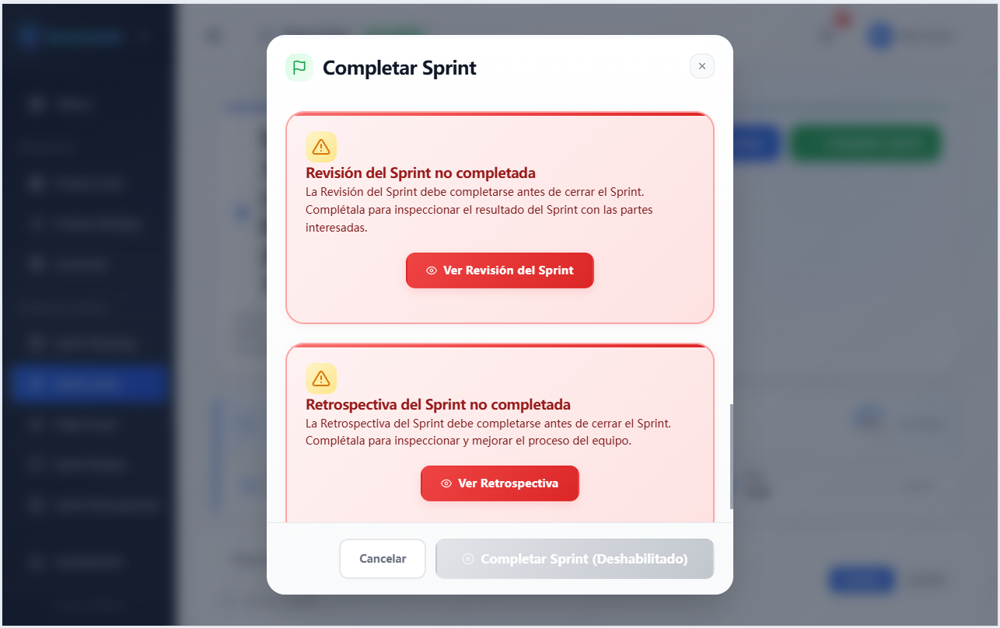

# Scrumooth — la Scrum Guide, aplicada.

**Juzgue una herramienta Scrum por las reglas que respeta, no por los tableros que dibuja.**

**Scrumooth** es una aplicación web autohospedada y de código abierto para equipos que trabajan con Scrum. Está pensada para Scrum Masters, Product Owners y equipos liderados por ingeniería que quieren que el proceso se someta a la Guide. Convierte las reglas de la **Scrum Guide 2020** en barreras que el backend aplica siempre que una herramienta puede hacerlo — y declara los puntos en los que deliberadamente no lo hace.

**No** es un sustituto de su gestor de incidencias. Como la capa de aplicación de la Scrum Guide que su gestor no tiene, es propietario del ciclo de vida del Sprint, de los roles y de las barreras, y se niega a que una violación del proceso pase en silencio. Su gestor conserva su registro; esto conserva sus reglas. Todas las reglas que aplica se resumen en [Qué aplica Scrumooth](#what-scrumooth-enforces) y se catalogan código por código en el [catálogo de rechazos de barreras](docs/api/README.md#gate-rejections) — y no se reivindica ninguna regla fuera de ese catálogo.

Ejecutar una segunda herramienta tiene un coste real — algo más que desplegar, proteger, respaldar y mantener. Scrumooth es deliberadamente el sistema más pequeño capaz de asumirlo: un único stack de Compose —proxy inverso, backend, frontend, PostgreSQL y copias de seguridad programadas— y una sola base de datos de la que ocuparse.

> **Idiomas:** [English](README.md) | [Deutsch](README.de.md) | [Español](README.es.md) | [Français](README.fr.md) | [Italiano](README.it.md)

[](https://opensource.org/licenses/Apache-2.0)
[](https://github.com/orbivort/scrumooth/actions/workflows/ci.yml)
[](https://codecov.io/github/orbivort/scrumooth)
[](https://github.com/orbivort/scrumooth/releases)
[](https://github.com/orbivort/scrumooth/issues)

[](https://www.typescriptlang.org/)
[](https://nodejs.org/)
[](https://www.postgresql.org/)

<p align="center">
  
</p>

<a id="live-demo"></a>

## 🖥️ Demo en vivo

Pruebe Scrumooth al instante en su navegador, sin necesidad de instalación. La demo se ejecuta con datos simulados (no requiere backend), de modo que puede explorar el ciclo de vida completo de Scrum de inmediato.

<p align="center">
  <a href="https://orbivort.github.io/scrumooth/" target="_blank" rel="noopener noreferrer">
    <strong>👉 Abrir la demo en vivo en GitHub Pages</strong>
  </a>
</p>

> **Nota:** La demo se ejecuta por completo en su navegador, sobre un universo ficticio de personas, equipos y productos inventados — en ella no aparece ningún nombre, empleador ni dato real. Inicie sesión con un solo clic desde las tarjetas de personajes de la página de inicio de sesión y elija un rol para ver qué puede hacer ese rol (una persona ocupa deliberadamente un rol distinto en cada equipo). Las solicitudes las responde un backend simulado, así que cualquier cambio que realice dura lo que dure su sesión y se restablece al recargar. Para datos persistentes y colaboración multiusuario, siga la guía de [Instalación](#installation) para autohospedar su propia instancia.

---

## Tabla de contenidos

**Entender Scrumooth**

- [Demo en vivo](#live-demo)
- [El manifiesto](#the-manifesto)
- [Qué aplica Scrumooth](#what-scrumooth-enforces)
- [Para quién es](#who-its-for)
- [Por qué puede confiar en él](#why-you-can-trust-it)
- [Características](#features)

**Autohospedaje y desarrollo**

- [Stack tecnológico](#tech-stack)
- [Estructura del proyecto](#project-structure)
- [Inicio rápido](#quick-start)
- [Requisitos previos](#prerequisites)
- [Instalación](#installation)
- [Comandos de desarrollo habituales](#development-commands)
- [Pruebas](#testing)
- [Pruebas de carga (k6)](#load-testing-k6)
- [Calidad del código](#code-quality)
- [Gestión de la base de datos](#database-management)
- [Soporte de Docker](#docker-support)
- [Despliegue](#deployment)
- [Solución de problemas](#troubleshooting)

**Proyecto**

- [Documentación](#documentation)
- [Hoja de ruta](#roadmap)
- [Contribuciones](#contributing)
- [Licencia](#license)

---

<a id="the-manifesto"></a>

## 📜 El manifiesto — Por qué existe Scrumooth

> La mayoría de las herramientas de gestión de proyectos están hechas para **registrar** lo que ha ocurrido. Le dan tableros, registran sus clics, dibujan gráficos precisos —después de que el Sprint haya terminado. Registrar es genuinamente útil, y esas herramientas lo hacen bien.
>
> Pero un registro es una descripción, no una decisión. La Scrum Guide 2020 está llena de reglas a las que una herramienta podría obligarle: un Sprint se cierra solo después de su Sprint Review y su Sprint Retrospective, solo los Developers estiman el trabajo, un único Product Owner es dueño del Product Backlog, y «Done» significa que se ha cumplido la Definition of Done. Cuando una de ellas se escapa —un Sprint cerrado antes de que se celebrara su Sprint Retrospective, un Product Owner estimando el trabajo en nombre de los Developers, un elemento marcado como Done sin verificar sus criterios—, ese incumplimiento suele pasar inadvertido hasta que el Sprint termina. En la mayoría de las herramientas, esas reglas son orientativas: un entendimiento compartido que se confía a la memoria del equipo.
>
> **Scrumooth las trata como reglas.**
>
> La disciplina no es el ingrediente que falta —si bastara por sí sola, ningún equipo habría cerrado jamás un Sprint sin su Sprint Retrospective. La Guide dice a un equipo qué hacer; no puede advertir cuándo el equipo deja de hacerlo. Por eso incorporamos la **Scrum Guide 2020** como código ejecutable y la **aplicamos** en el servidor, donde ni la interfaz ni una llamada directa a la API pueden eludirla. Somos un **guardián, no un tomador de notas**.
>
> Menos debates sobre procesos. Más tiempo entregando software que funciona.

<a id="what-scrumooth-enforces"></a>

## 🔒 Qué aplica Scrumooth

Estas son barreras, no advertencias ni sugerencias. En todos los casos siguientes la respuesta es no — y cada respuesta se sostiene en la capa de servicio del backend, de modo que un atajo en el frontend no puede sortearla.

Cada una es un rechazo distinto que el backend puede devolver, y el contrato contiene **68** de ellos: 39 barreras de la Guide, 5 barreras de prácticas complementarias y 24 barreras de integridad del proceso — contadas a partir de ese único contrato y verificadas en CI, de modo que los totales de aquí no pueden desviarse de lo que aplica el código.

Las tablas siguientes agrupan las barreras por lo que protegen y nombran la regla principal que aplica cada una. El **catálogo completo, código por código** — cada código de rechazo `GATE_*` con el estado HTTP con el que se devuelve — es el [catálogo de rechazos de barreras](docs/api/README.md#gate-rejections), que es la única fuente de verdad. Esta sección es un recorrido guiado por ese catálogo, no un sustituto de él.

| Una regla de la Scrum Guide 2020, planteada como pregunta                                                            | La respuesta de Scrumooth                                                                                                                                                                                                                                                                                           |
| -------------------------------------------------------------------------------------------------------------------- | ------------------------------------------------------------------------------------------------------------------------------------------------------------------------------------------------------------------------------------------------------------------------------------------------------------------- |
| ¿Puede cerrarse un Sprint antes de su Sprint Review y su Sprint Retrospective?                                       | Se rechaza la finalización del Sprint hasta que ambos eventos queden registrados ([API de sprints](docs/api/sprints.md)).                                                                                                                                                                                           |
| ¿Puede un elemento llamarse Done sin su Definition of Done?                                                          | Completar un Sprint nunca marca elementos como Done — cada elemento debe superar su lista de verificación de la Definition of Done ([API de Definition of Done](docs/api/definition-of-done.md)).                                                                                                                   |
| ¿Puede un equipo tener más de un Product Owner o más de un Scrum Master?                                             | Se rechaza añadir un segundo titular de cualquiera de los dos roles ([API de equipos](docs/api/teams.md)).                                                                                                                                                                                                          |
| ¿Puede un equipo superar el tamaño de un Scrum Team?                                                                 | El tamaño del equipo está limitado — `TEAM_MAX_SIZE`, por defecto `10` ([API de equipos](docs/api/teams.md)).                                                                                                                                                                                                       |
| ¿Pueden dos equipos de un mismo producto tener dos Definitions of Done?                                              | No: un grupo de equipos posee una sola Definition of Done que sus equipos leen, un equipo agrupado no puede editar la suya y al unirse se registra la versión adoptada ([API de Team Groups](docs/api/team-groups.md)).                                                                                             |
| ¿Puede alguien que no sea un Developer estimar el trabajo?                                                           | Solo los Developers pueden estimar elementos del Product Backlog — cualquier otro rol recibe `403 Forbidden` ([API de Product Backlog](docs/api/product-backlog.md)).                                                                                                                                               |
| ¿Pueden el Product Owner o el Scrum Master redactar el Daily Scrum?                                                  | Solo los Developers pueden redactar el registro diario o unirse a él; el Product Owner y el Scrum Master observan ([API de Daily Scrum](docs/api/daily-scrum.md)).                                                                                                                                                  |
| ¿Puede cancelar un Sprint alguien que no sea el Product Owner?                                                       | La cancelación es exclusiva del Product Owner, y solo mientras el Sprint está `ACTIVE` ([API de sprints](docs/api/sprints.md)).                                                                                                                                                                                     |
| ¿Puede reescribirse un Increment ya entregado?                                                                       | Los Increments entregados y archivados son terminales — ni pueden reescribirse, ni volver a entregarse, ni revivirse ([API de increments](docs/api/increments.md)).                                                                                                                                                 |
| ¿Puede vaciarse la Definition of Done?                                                                               | Una Definition of Done debe conservar al menos un elemento activo; no puede comprometerse un Sprint Backlog ni iniciarse un Sprint mientras un equipo no tenga ninguna; y el trabajo no puede marcarse como Done mientras un equipo no tenga ninguna ([API de Definition of Done](docs/api/definition-of-done.md)). |
| ¿Puede un Increment marcarse como utilizable, o entregarse, sin evidencia?                                           | Un Increment debe atestiguarse como utilizable por escrito — con quién lo atestiguó y cuándo — antes de poder verificarse o entregarse ([API de increments](docs/api/increments.md)).                                                                                                                               |
| ¿Puede alguien ajeno al equipo leer o entregar un Increment?                                                         | Un Increment pertenece a su Scrum Team: leerlo, verificarlo o entregarlo requiere pertenecer al equipo ([API de increments](docs/api/increments.md)).                                                                                                                                                               |
| ¿Puede un Increment omitir en silencio trabajo que alcanzó el estado Done?                                           | La composición informa de su resultado (compuesta, omitida con un motivo, o fallida), y el Increment de un Sprint puede conciliarse a partir de sus elementos Done ([API de increments](docs/api/increments.md)).                                                                                                   |
| ¿Puede cerrarse un Sprint mientras aún tiene Impediments sin resolver?                                               | No: un Sprint no puede completarse mientras algún Impediment siga en estado `OPEN` o `IN_PROGRESS`, y ambos estados terminales de un Impediment exigen una resolución por escrito ([API de impediments](docs/api/impediments.md), [API de sprints](docs/api/sprints.md)).                                           |
| ¿Pueden la Sprint Review o la Sprint Retrospective celebrarse fuera de orden, o antes de la fecha de fin del Sprint? | No: la Retrospective no puede completarse antes de su Review, y ningún evento puede completarse antes del día que indica la fecha de fin del Sprint ([API de sprint reviews](docs/api/sprint-reviews.md), [API de retrospectives](docs/api/retrospectives.md)).                                                     |
| ¿Puede cambiar el Sprint Goal, o el Sprint Backlog moverse en su contra, una vez que el Sprint está en marcha?       | No: el Goal queda bloqueado una vez que el Sprint está en marcha, y un cambio que ponga en peligro el objetivo permanece pendiente hasta que el Product Owner lo reconozca ([API de sprints](docs/api/sprints.md)).                                                                                                 |
| ¿Puede el registro del Daily Scrum omitir lo que adaptó?                                                             | No: un registro debe declarar al menos un ajuste del Sprint Backlog, o reconocer explícitamente que no hizo falta ninguno ([API de daily scrum](docs/api/daily-scrum.md)).                                                                                                                                          |
| ¿Puede un Sprint durar más de un mes, solaparse con otro Sprint o empezar tras un intervalo?                         | No: un Sprint puede abarcar como máximo `SPRINT_MAX_DURATION_DAYS`, un equipo ejecuta un Sprint a la vez, y un nuevo Sprint comienza inmediatamente después del anterior ([API de sprints](docs/api/sprints.md)).                                                                                                   |
| ¿Puede crearse el Sprint Backlog sin todo el Scrum Team?                                                             | No: un Sprint no puede iniciarse a menos que se registre la asistencia a la planificación y esta incluya al Product Owner y al menos a un Developer, y a menos que el plan encaje en la capacidad registrada ([API de sprints](docs/api/sprints.md)).                                                               |
| ¿Puede alguien que no sea el Product Owner ordenar el Product Backlog?                                               | No: el orden del backlog y la banda MoSCoW son decisión exclusiva del Product Owner ([API de Product Backlog](docs/api/product-backlog.md)).                                                                                                                                                                        |
| ¿Puede un equipo perseguir más de un Product Goal, o dejar que el trabajo del backlog se aleje de él?                | No: un único Product Goal `ACTIVE` a la vez; los elementos se anclan a él; el Goal es exclusivo del Product Owner y no puede completarse sin evidencia registrada ([API de Product Goals](docs/api/product-goals.md)).                                                                                              |
| ¿Puede iniciarse un Sprint sin un Product Goal?                                                                      | No: un Sprint no puede iniciarse hasta que esté vinculado a un Product Goal ([API de sprints](docs/api/sprints.md)).                                                                                                                                                                                                |
| ¿Puede verificarse un Increment antes de integrarse con los Increments anteriores?                                   | No: se comprueba que sea «aditivo respecto a todos los Increments anteriores y esté verificado a fondo» antes de que un Increment pueda pasar a `VERIFIED` o entregarse ([API de increments](docs/api/increments.md)).                                                                                              |
| ¿Puede entregarse un Increment con una simple escritura de estado?                                                   | No: solo se puede llegar a `DELIVERED` mediante la acción de entrega, que registra cómo llegó el valor a los usuarios ([API de increments](docs/api/increments.md)).                                                                                                                                                |
| ¿Puede desvincularse en silencio una mejora de la Retrospective?                                                     | No: una vez que una mejora ha producido un elemento del Product Backlog, o se ha vinculado a él, ese vínculo es la evidencia de que se abordó y no puede eliminarse ([API de retrospectives](docs/api/retrospectives.md)).                                                                                          |
| ¿Puede completarse una Sprint Review sin juzgar el Sprint Goal?                                                      | No: una Review de un Sprint que tiene un Goal no puede completarse sin el veredicto registrado del equipo, y un Sprint sin Goal no puede tener veredicto alguno ([API de sprint reviews](docs/api/sprint-reviews.md)).                                                                                              |

### Prácticas complementarias que Scrumooth también aplica

Estas **no son reglas de la Scrum Guide 2020** — los tres artefactos de la Guide son el Product Backlog, el Sprint Backlog y el Increment, y la Definition of Ready no es ninguno de ellos. Son añadidos propios del producto, etiquetados como tales en la interfaz, y se enumeran aquí por separado para que la tabla anterior siga significando exactamente lo que dice.

| Una práctica que Scrumooth aplica, planteada como pregunta                                       | La respuesta de Scrumooth                                                                                                                                                                                                                                                                                                                                                                                  |
| ------------------------------------------------------------------------------------------------ | ---------------------------------------------------------------------------------------------------------------------------------------------------------------------------------------------------------------------------------------------------------------------------------------------------------------------------------------------------------------------------------------------------------- |
| ¿Puede un equipo acordar qué significa «ready» y planificar de todos modos?                      | No: la Definition of Ready del equipo se aplica en el límite del Sprint. Se rechaza comprometer un Sprint Backlog o iniciar un Sprint mientras un elemento seleccionado siga teniendo un criterio de preparación activo sin verificar — el rechazo nombra los elementos — y se rechaza mientras el equipo no tenga ningún criterio activo ([API de Definition of Ready](docs/api/definition-of-ready.md)). |
| ¿Puede un Sprint Backlog incluir un elemento que no se ha refinado hasta estar «ready»?          | No: un elemento debe refinarse hasta `READY` antes de poder entrar en un Sprint — en el momento de la planificación exactamente igual que cuando se añade a mitad de Sprint ([API de Product Backlog](docs/api/product-backlog.md)).                                                                                                                                                                       |
| ¿Quién mantiene el acuerdo de preparación?                                                       | Únicamente el Scrum Master del equipo. El acuerdo de preparación es la práctica declarada de un rol, no un compromiso compartido del Scrum Team, así que corresponde al Scrum Master darle forma o retirarlo ([API de Definition of Ready](docs/api/definition-of-ready.md)).                                                                                                                              |
| ¿Puede alguien ajeno al equipo leer el acuerdo de preparación o registrar un veredicto sobre él? | No: leerlo o registrar una verificación de preparación requiere pertenecer al equipo que lo posee ([API de Definition of Ready](docs/api/definition-of-ready.md)).                                                                                                                                                                                                                                         |

Merece la pena exponer con claridad dos consecuencias. Como es una regla del producto y no de la Guide, un equipo que no quiera una Definition of Ready se la encontrará igualmente: Scrumooth crea seis criterios predeterminados sensatos la primera vez que se lee el acuerdo, y el Scrum Master del equipo puede darles forma o retirarlos. Y como rechazar un Sprint por un artefacto ajeno a la Guide es una disyuntiva real, la lista de verificación dice lo que es con sus propias palabras —una práctica complementaria, no un artefacto de la Guide— en lugar de tomar prestada la autoridad de la Guide.

### Barreras de integridad del proceso y transparencia

Una tercera clase no es ni una barrera de la Guide ni una práctica complementaria, sino la lectura que hace el producto de la transparencia y la autogestión de la Guide: el trabajo de un Scrum Team pertenece a ese equipo, y el material sincero pertenece al rol responsable de él. Se enumeran por separado por la misma razón que las prácticas anteriores.

| Un límite que Scrumooth aplica, planteado como pregunta                                        | La respuesta de Scrumooth                                                                                                                                                                                                                                                                                                                                                                                                        |
| ---------------------------------------------------------------------------------------------- | -------------------------------------------------------------------------------------------------------------------------------------------------------------------------------------------------------------------------------------------------------------------------------------------------------------------------------------------------------------------------------------------------------------------------------- |
| ¿Puede alguien ajeno al equipo leer o cambiar los artefactos de un equipo?                     | No: un Sprint, un Impediment, una Definition of Done, un Increment, una Review, una Retrospective, una comprobación de salud de los valores de Scrum, una barrera organizativa, un informe y los acuerdos de trabajo del equipo están cada uno acotados al equipo que los posee — leer o escribir cualquiera de ellos requiere pertenecer a ese equipo ([catálogo de rechazos de barreras](docs/api/README.md#gate-rejections)). |
| ¿Puede alguien que no sea el Scrum Master leer o escribir el material propio del Scrum Master? | No: las notas del Scrum Master sobre un Sprint, una Review y una Retrospective, el registro de coaching, la evaluación de polivalencia, los resultados de una comprobación de salud de los valores y el acuerdo de preparación son exclusivamente suyos ([catálogo de rechazos de barreras](docs/api/README.md#gate-rejections)).                                                                                                |
| ¿Puede un Impediment escalarse a barrera dos veces, o por otro equipo?                         | No: una sola barrera por Impediment, planteada únicamente por el equipo que planteó el Impediment, y solo el Scrum Master del equipo puede plantearla, modificarla, resolverla o cerrarla — un estado terminal exige una resolución por escrito ([API de Barreras organizativas](docs/api/organizational-barriers.md)).                                                                                                          |
| ¿Puede un equipo cambiar qué Definition of Done compartida le rige sin su liderazgo?           | No: unirse a un grupo o salir de él decide el compromiso al que queda sujeto el equipo, así que es decisión del Product Owner o del Scrum Master del equipo; un equipo pertenece como máximo a un grupo, y un grupo que aún tiene equipos no puede eliminarse por debajo de ellos ([API de Team Groups](docs/api/team-groups.md)).                                                                                               |

**Donde Scrumooth deliberadamente no aplica nada:** la Prime Directive de la Sprint Retrospective queda en manos de quien facilita, y las timeboxes de los eventos se muestran mediante un temporizador compartido del equipo en lugar de dar por terminado un evento por la fuerza. La Guide pide autogestión exactamente en esos puntos, así que Scrumooth no decide por el equipo.

**Cómo se ve una barrera en la práctica.** Es viernes, el Sprint debe terminar, el Increment está desplegado — y la Sprint Retrospective nunca se programó. Una herramienta de registro cierra el Sprint y la Sprint Retrospective se pospone a la semana siguiente, que es el fallo que el evento final de la Guide existe para prevenir; Scrumooth rechaza el cierre hasta que ambos eventos queden registrados. El equipo celebra entonces la Sprint Retrospective, o se detiene y debate por qué no —la versión de esa decisión que la Guide espera que un equipo tome de forma consciente.

¿Por qué las herramientas que ya utiliza no van a añadir esto sin más? En nuestra opinión, porque una barrera que se puede desactivar es una configuración, no una regla, y la configurabilidad es su argumento de venta y no su descuido. Tampoco un servicio alojado puede prometer fácilmente que sus datos de proceso nunca saldrán de su infraestructura. Scrumooth no es una función que les falte; es una disyuntiva que ya han resuelto en el otro sentido.

Las tablas anteriores son la afirmación sobre la Scrum Guide 2020, agrupadas por lo que protegen, y el [catálogo de rechazos de barreras](docs/api/README.md#gate-rejections) es el catálogo completo, código por código, de cada rechazo que Scrumooth puede devolver. Si una regla no se aplica en ese catálogo, Scrumooth no la aplica — y, dado que nunca se ofrece una configuración que rompa la Guide, **la negativa es el producto.** Las prácticas complementarias y las barreras de integridad del proceso son añadidos propios del producto, mantenidos en tablas separadas y etiquetados para que las tres clases nunca puedan confundirse entre sí — la clase de cada barrera se declara junto al contrato, de modo que la separación se verifica en CI en lugar de afirmarse aquí.

<a id="who-its-for"></a>

## 🎯 Para quién es

**Scrumooth está pensado para una situación concreta:** organizaciones lideradas por ingeniería que deben poder demostrar cómo se ejecutó realmente un Sprint y para las que los datos del proceso no pueden salir de su propia infraestructura — sectores regulados, sus proveedores y equipos del sector público.

**Scrumooth es para usted si…**

- Es **Scrum Master o Product Owner**, a su equipo le cuesta mantener la Scrum Guide 2020 y quiere que la herramienta rechace la deriva en lugar de permitirla en silencio.
- Lidera un **equipo de ingeniería** que quiere autohospedar sus datos de proceso por motivos de privacidad, cumplimiento normativo o soberanía de datos.
- Necesita un **registro defendible y auditable** de cómo se ejecutó realmente cada Sprint — quién cambió qué, cuándo y con qué rol.
- Quiere que los límites de la Scrum Guide se codifiquen una sola vez, para que los nuevos miembros del equipo aprendan el proceso usándolo.

**Scrumooth no es para usted si…**

- Busca una herramienta de seguimiento de incidencias de propósito general, un planificador de hoja de ruta o un tablero Kanban para trabajo que no sea Scrum. Scrumooth se niega a ser una de ellas.
- Quiere que todas las reglas sean configurables. Scrumooth rechaza las configuraciones que rompen la Scrum Guide.
- Quiere un SaaS totalmente gestionado. Scrumooth es autohospedado por diseño.
- Necesita gestión de carteras, planificación de recursos o seguimiento financiero en profundidad para muchos proyectos no relacionados.
- Sigue un marco escalado que adapta la Guide para una organización más amplia, o Scrum todavía no es la forma de trabajar de su equipo. Scrumooth aplica la Scrum Guide 2020 tal como está escrita, para un único Scrum Team.

<a id="why-you-can-trust-it"></a>

## 🛡 Por qué puede confiar en él

**Por qué no un servicio alojado**

- **Autohospedado por diseño.** Sus datos de proceso nunca salen de su infraestructura.
- **Soberanía de datos integrada.** La exportación de datos del RGPD, un periodo de gracia de 14 días para el borrado y el seguimiento del consentimiento vienen con el producto.
- **Auditable.** Cada cambio de rol y cada transición de estado se escriben en un registro de auditoría dedicado y separado por cumplimiento normativo.
- **Acceso acotado.** Las sesiones simultáneas están limitadas y las más antiguas se revocan automáticamente.

**Por qué no otra herramienta autohospedada**

- **Abierta e inspeccionable.** Apache-2.0, CI pública, cobertura publicada — se aplica una **barrera del 80 % en líneas, ramas, funciones y sentencias** en la canalización.
- **Probada bajo carga, no solo con pruebas unitarias.** 10 escenarios k6 predefinidos, incluido un pico de Sprint Planning. Consulte [Pruebas de carga](#load-testing-k6).
- **Estricta por construcción.** Modo estricto de TypeScript en el backend, el frontend y los paquetes compartidos.
- **Localizada donde importa.** La interfaz se ofrece en inglés, alemán, español, francés e italiano, con terminología Scrum procedente de la Scrum Guide oficial.

**Para quienes tienen que aprobarla internamente.** La guía de despliegue, la arquitectura de seguridad y el proceso de notificación de vulnerabilidades están documentados en el repositorio: [Despliegue](#deployment), [`docs/architecture/security-architecture.md`](docs/architecture/security-architecture.md) y [`SECURITY.md`](SECURITY.md).

<a id="features"></a>

## ✨ Características

### El flujo de trabajo Scrum

Todo lo necesario para ejecutar el Sprint — los cinco eventos, tres artefactos y tres compromisos de la Guide — con la regla que sostiene cada uno. Las cláusulas en negrita destacan las barreras de [Qué aplica Scrumooth](#what-scrumooth-enforces); el catálogo completo es el [catálogo de rechazos de barreras](docs/api/README.md#gate-rejections).

- **Product Goal** - Alineación estratégica y seguimiento de objetivos; el compromiso al que sirve el backlog; **solo el Product Owner crea o edita uno, solo uno puede estar `ACTIVE` a la vez, y no puede completarse sin evidencia registrada**
- **Product Backlog** - Priorización MoSCoW (Must, Should, Could, Won't); **solo los Developers estiman el trabajo, y solo el Product Owner lo ordena y fija su banda**
- **Sprint Planning** - Duraciones de Sprint configurables y planificación de la capacidad; **solo los Developers guardan el Sprint Backlog**, un Sprint no puede iniciarse hasta que se registre la asistencia a la planificación con el Product Owner y un Developer, y ningún elemento entra en el Sprint antes de refinarse hasta `READY`
- **Sprint Execution** - Tablero Kanban interactivo con arrastrar y soltar; **solo el Product Owner puede cancelar, y solo mientras el Sprint está `ACTIVE`**; el Sprint Goal queda bloqueado una vez en marcha, y un cambio que ponga en peligro el objetivo espera al reconocimiento del Product Owner
- **Daily Scrum** - Registro diario compartido, con afloramiento de Impediments; **solo los Developers lo redactan — el Product Owner y el Scrum Master observan**; un registro debe declarar lo que adaptó, o que no hizo falta adaptar nada
- **Impediment** - Identificación de bloqueos y seguimiento de su resolución con priorización por impacto (Critical/High/Medium/Low) y fechas objetivo; **un Sprint no puede cerrarse antes de que se resuelvan sus Impediments**, ambos estados terminales exigen una resolución por escrito, cada escritura está acotada al equipo que planteó el Impediment, y un Impediment sin propietario recae en el Scrum Master — a quien se notifica cuando uno supera el umbral de escalado por antigüedad
- **Increment** - Gestión del Increment de producto; **en el momento en que un elemento del Product Backlog cumple la Definition of Done, nace un Increment**; un Increment se verifica solo después de integrarse con todos los Increments anteriores, se atestigua como utilizable por escrito antes de poder verificarse o entregarse, y se entrega solo con un método de entrega registrado
- **Sprint Review** - Gestión de la revisión, comentarios de las partes interesadas y ajuste del backlog; **un Sprint no puede cerrarse antes de que se registre su Sprint Review**; la Review no puede completarse antes de la fecha de fin del Sprint, un Sprint con un Goal no puede completarse sin el veredicto del propio equipo sobre él, y un Sprint sin Goal no puede tener veredicto alguno
- **Sprint Retrospective** - Reflexión del equipo y mejora con seguimiento; **un Sprint no puede cerrarse antes de que se registre su Sprint Retrospective**; no puede completarse antes de su Review, aplicar cambios en la Definition of Done exige una reflexión registrada, y una mejora ya vinculada a un elemento del Product Backlog no puede desvincularse

### Gobernanza y operaciones

- **Motor de flujo de trabajo** - Permisos basados en roles y transiciones de estado controladas, **aplicadas en el servidor**
- **Definition of Done/Ready** - Listas de verificación personalizables; **nada está Done hasta que se supera su lista de verificación**, el acuerdo de preparación corresponde mantenerlo al Scrum Master del equipo, y un equipo integrado en un grupo se rige por la única Definition of Done del grupo
- **Integridad de los Increments** - **El trabajo entregado no puede reescribirse en silencio**

### Equipo y organización

- **Composición del equipo** - Un Product Owner y un Scrum Master; **tamaño del equipo limitado** (`TEAM_MAX_SIZE`, por defecto `10`)
- **Team Groups** - Varios Scrum Teams sobre un mismo producto comparten una única Definition of Done; **un equipo agrupado no puede editar la suya, al unirse se registra la versión adoptada, y solo el liderazgo de un equipo puede unirse a un grupo o salir de él**
- **Registro de auditoría** - Registro dedicado y separado por cumplimiento normativo; **cada cambio de rol y cada transición de estado registrados**
- **Panel e informes** - Métricas y visualizaciones en tiempo real; **cada informe está acotado al equipo cuya historia describe**
- **Comunicación del equipo** - Notificaciones y mensajería integradas
- **Team Health Check** - Comprobación periódica frente a los cinco valores de Scrum; **los resultados solo puede leerlos el Scrum Master del equipo**
- **Barreras organizativas** - El registro de lo que bloquea a un equipo desde fuera y de las acciones emprendidas para eliminarlo; **solo el Scrum Master del equipo puede plantear, modificar, resolver o cerrar una, y cerrarla exige una resolución por escrito**
- **Facilitación** - El registro de coaching del Scrum Master, los acuerdos de trabajo del equipo y la evaluación de polivalencia; **el material sincero pertenece al Scrum Master y los acuerdos del equipo al equipo**
- **Timeboxes de eventos compartidas** - Un reloj para todos los participantes; **las timeboxes se muestran, nunca se cierran a la fuerza**
- **Controles de privacidad** - Derechos de exportación y borrado de datos, además de seguimiento del consentimiento

<a id="tech-stack"></a>

## 🛠 Stack tecnológico

### Backend

- **Runtime:** Node.js 24+
- **Framework:** Express.js 5
- **Lenguaje:** TypeScript (modo estricto)
- **Base de datos:** PostgreSQL 18+ con Prisma ORM 7
- **Autenticación:** JWT con bcrypt
- **Validación:** Zod
- **Trabajos programados:** node-cron
- **Correo electrónico:** Nodemailer (proveedores SMTP, SendGrid, AWS SES)
- **Registro:** Winston con transports de archivos rotativos

### Frontend

- **Framework:** React 19 con Vite
- **Lenguaje:** TypeScript (modo estricto)
- **Enrutamiento:** React Router 8
- **Gestión de estado:** TanStack Query (React Query) + Zustand
- **Visualización:** Chart.js
- **Estilos:** CSS Modules con Design Tokens
- **Seguimiento de errores:** Sentry (opcional, vía `VITE_SENTRY_DSN`)

### Compartido

- Tipos e interfaces de TypeScript
- Constantes y enumeraciones
- Funciones de utilidad

### Pruebas y calidad

- **Unitarias / Integración:** Vitest
- **End-to-End:** Playwright (frontend) + Vitest (backend)
- **Pruebas de carga:** k6 (10 escenarios predefinidos)
- **Linting:** ESLint + Stylelint
- **Formato:** Prettier
- **Git Hooks:** Husky + lint-staged

<a id="project-structure"></a>

## 📁 Estructura del proyecto

```
scrumooth/
├── packages/
│   ├── backend/              # API REST Express.js
│   │   ├── src/
│   │   │   ├── controllers/  # Manejadores de rutas API
│   │   │   ├── services/     # Capa de lógica de negocio
│   │   │   ├── middleware/   # Middleware de Express
│   │   │   ├── routes/       # Definiciones de rutas API
│   │   │   ├── utils/        # Funciones de utilidad
│   │   │   └── __tests__/    # Pruebas unitarias, de integración y e2e
│   │   ├── prisma/           # Esquema de base de datos y migraciones
│   │   ├── Dockerfile        # Imagen de producción
│   │   └── Dockerfile.dev    # Imagen de desarrollo
│   ├── frontend/             # Frontend React + Vite
│   │   ├── src/
│   │   │   ├── components/   # Componentes React
│   │   │   ├── pages/        # Páginas a nivel de ruta
│   │   │   ├── hooks/        # Hooks de React personalizados
│   │   │   ├── services/     # Servicios de cliente API
│   │   │   ├── stores/       # Stores de Zustand
│   │   │   └── styles/       # CSS y design tokens
│   │   ├── e2e/              # Pruebas end-to-end de Playwright
│   │   ├── Dockerfile        # Imagen de producción
│   │   └── Dockerfile.dev    # Imagen de desarrollo
│   └── shared/               # Tipos, constantes y utilidades compartidas
├── docs/
│   ├── api/                  # Referencia de la API REST
│   ├── architecture/         # Diseño del sistema, modelo de datos, seguridad
│   ├── deployment/           # Guías de despliegue
│   └── user-guide/           # Documentación y guías de usuario
├── k6/                       # Escenarios de pruebas de carga (k6)
│   └── scripts/scenarios/    # escenarios de pruebas de carga predefinidos
├── scripts/                  # Scripts de build y utilidades
├── .github/workflows/        # CI, Release y despliegue en GitHub Pages
├── docker-compose.yml        # Docker Compose de producción
├── docker-compose.dev.yml    # Docker Compose de desarrollo
├── CHANGELOG.md              # Historial de versiones
├── SECURITY.md               # Política de seguridad y reportes
├── CONTRIBUTING.md           # Directrices de contribución
├── CODE_OF_CONDUCT.md        # Código de conducta de la comunidad
└── THIRD-PARTY-NOTICES.md    # Atribuciones de licencias de terceros
```

<a id="quick-start"></a>

## ⚡ Inicio rápido

La forma más rápida de ejecutar una instancia local es con Docker Compose:

```bash
git clone https://github.com/orbivort/scrumooth.git
cd scrumooth
cp packages/backend/.env.production.example packages/backend/.env.production
docker compose up -d
```

Esto inicia el proxy inverso Caddy, el backend, el frontend y PostgreSQL. Una vez en ejecución, abra <http://localhost> (HTTPS está habilitado por defecto en el puerto 443). Para una configuración manual completa (sin Docker), consulte [Instalación](#installation).

> **Nota:** El stack de Compose de producción requiere `packages/backend/.env.production`. Si prefiere un entorno de desarrollo completamente preconfigurado con recarga en caliente, utilice `docker compose -f docker-compose.dev.yml up` en su lugar.

<a id="prerequisites"></a>

## 📋 Requisitos previos

- **Node.js** v24.19.0 o superior
- **pnpm** v11.21.0 o superior
- **PostgreSQL** v18 o superior
- **Docker** y **Docker Compose** (opcional, para el inicio rápido)

<a id="installation"></a>

## 🚀 Instalación

### 1. Clonar el repositorio

```bash
git clone https://github.com/orbivort/scrumooth.git
cd scrumooth
```

### 2. Instalar dependencias

Este proyecto utiliza pnpm como gestor de paquetes. El proyecto exige pnpm mediante scripts de preinstalación.

```bash
pnpm install
```

### 3. Configuración del entorno

Copie los archivos de entorno de ejemplo y configure sus ajustes:

```bash
# Backend configuration
cp packages/backend/.env.example packages/backend/.env

# Frontend configuration
cp packages/frontend/.env.example packages/frontend/.env
```

Ambos archivos de ejemplo están documentados por completo en sus propios comentarios. Una ejecución local del backend solo necesita tres valores:

| Variable       | Propósito                                                          |
| -------------- | ------------------------------------------------------------------ |
| `DATABASE_URL` | Cadena de conexión de PostgreSQL                                   |
| `JWT_SECRET`   | Clave de firma, de al menos 64 caracteres (`openssl rand -hex 64`) |
| `CORS_ORIGIN`  | El origen del frontend, p. ej. `http://localhost:5173`             |

El frontend no necesita ninguna configuración para el desarrollo local: `VITE_API_URL` se resuelve con el proxy de desarrollo. Para desarrollar sin backend alguno, establezca `VITE_USE_MOCK_API=true` y ejecute `pnpm run dev:frontend` — consulte [Desarrollo sin backend](./CONTRIBUTING.md#developing-without-a-backend) y la [arquitectura del mock](./docs/architecture/frontend-mock-architecture.md). Todas las variables restantes se enumeran en [`packages/backend/.env.example`](packages/backend/.env.example) y [`packages/frontend/.env.example`](packages/frontend/.env.example).

### 4. Configuración de la base de datos

Genere el cliente de Prisma y luego cree el esquema de su base de datos. Para el desarrollo local puede utilizar cualquiera de los dos enfoques:

```bash
# Generate Prisma client (always required)
pnpm run db:generate

# Option A: Push schema directly (fast iteration, no migration files)
pnpm run db:push

# Option B: Create and apply a migration (recommended for tracked changes)
pnpm run db:migrate
```

Para despliegues en producción, utilice `pnpm run db:migrate:prod` para aplicar las migraciones existentes sin solicitudes interactivas.

### 5. Iniciar el servidor de desarrollo

```bash
pnpm run dev
```

Esto iniciará los servidores de backend y frontend de forma simultánea. Para ejecutarlos de forma independiente:

```bash
pnpm run dev:backend    # Backend only (http://localhost:5001)
pnpm run dev:frontend   # Frontend only (http://localhost:5173)
```

<a id="development-commands"></a>

## 🛠 Comandos de desarrollo habituales

Para quienes desarrollan, la analogía más cercana es un linter para su proceso Scrum — con la diferencia que importa: un linter informa de una infracción, una barrera la rechaza.

Los comandos más comunes para el desarrollo diario:

| Tarea                        | Comando                 |
| ---------------------------- | ----------------------- |
| Iniciar backend + frontend   | `pnpm run dev`          |
| Iniciar solo backend         | `pnpm run dev:backend`  |
| Iniciar solo frontend        | `pnpm run dev:frontend` |
| Construir todos los paquetes | `pnpm run build`        |

<a id="testing"></a>

## 🧪 Pruebas

```bash
pnpm run test              # Todas las pruebas
pnpm run test:coverage     # Con informe de cobertura
pnpm run test:unit         # Solo pruebas unitarias
pnpm run test:integration  # Pruebas de integración del backend
pnpm run test:e2e          # End-to-end (backend Vitest + frontend Playwright)
pnpm run test:watch        # Modo watch
```

Umbrales de cobertura aplicados: **80 % de líneas, funciones, sentencias y ramas**.

<a id="load-testing-k6"></a>

### Pruebas de carga (k6)

Los escenarios de pruebas de carga predefinidos se encuentran en [`k6/scripts/scenarios/`](k6/scripts/scenarios). Copie [`k6/.env.k6.example`](k6/.env.k6.example) a `k6/.env.k6`, configure su destino y, a continuación, ejecute un escenario como:

```bash
pnpm run loadtest:normal    # Realistic everyday load
pnpm run loadtest:peak      # Sprint planning rush (worst-case concurrency)
pnpm run loadtest:stress    # Push the system until it breaks
```

> **Requisito previo:** Instale [k6](https://k6.io/docs/get-started/installation/) y asegúrese de que su backend de destino esté en ejecución. Hay diez escenarios en [`k6/scripts/scenarios/`](k6/scripts/scenarios); los scripts `loadtest:*` de [`package.json`](package.json) exponen ocho de ellos, incluidos endurance, multi-team, daily-scrum, auth y database stress.

<a id="code-quality"></a>

## 🔍 Calidad del código

| Tarea                  | Comando              |
| ---------------------- | -------------------- |
| Lint (ESLint)          | `pnpm run lint`      |
| Lint y autocorrección  | `pnpm run lint:fix`  |
| Lint CSS (Stylelint)   | `pnpm run lint:css`  |
| Formato (Prettier)     | `pnpm run format`    |
| Verificación de tipos  | `pnpm run typecheck` |
| Auditoría de seguridad | `pnpm run audit`     |

Consulte [`CONTRIBUTING.md`](CONTRIBUTING.md) para conocer el flujo de trabajo de desarrollo completo y las barreras de calidad.

<a id="database-management"></a>

## 🗄 Gestión de la base de datos

```bash
pnpm run db:generate     # Generar el cliente Prisma (tras cambios de esquema)
pnpm run db:migrate      # Crear y aplicar una migración (desarrollo)
pnpm run db:migrate:prod # Aplicar migraciones en producción (no interactivo)
pnpm run db:studio       # Abrir Prisma Studio (GUI de base de datos)
```

Comandos de base de datos adicionales (`db:push`, `db:reset`, `db:validate`, `db:migrate:test`) están documentados en [`CONTRIBUTING.md`](CONTRIBUTING.md).

<a id="docker-support"></a>

## 🐳 Soporte de Docker

El proyecto incluye configuración de Docker tanto para desarrollo como para despliegue en producción.

### Usar Docker Compose

```bash
# Development environment (with hot reload)
docker compose -f docker-compose.dev.yml up

# Production environment (detached)
docker compose up -d

# Tear down
docker compose down
```

### Construir imágenes Docker manualmente

> **Nota:** Todos los Dockerfiles referencian rutas relativas a la raíz del repositorio (archivos del workspace del monorepo como `package.json`, `pnpm-lock.yaml` y `packages/shared/`). Debe construirlos desde la **raíz del repositorio** y usar `-f` para apuntar al Dockerfile — pasar el directorio del paquete como contexto de build fallará.

```bash
# Development images (with dev dependencies and watch mode)
docker build -t scrumooth-backend:dev -f packages/backend/Dockerfile.dev .
docker build -t scrumooth-frontend:dev -f packages/frontend/Dockerfile.dev .

# Production images (build from the repo root)
docker build -t scrumooth-backend -f packages/backend/Dockerfile .
docker build -t scrumooth-frontend -f packages/frontend/Dockerfile .
```

<details>
<summary>Usar un mirror de registry/apt</summary>

Si se encuentra detrás de una red que requiere un registry de npm o un mirror de apt, puede configurarlos como argumentos de build o variables de entorno:

```bash
# Docker Compose
$env:NPM_REGISTRY="https://your_mirror_url"
$env:APT_MIRROR="your_mirror_url"

# Manual build
docker build --build-arg NPM_REGISTRY=https://your_mirror_url --build-arg APT_MIRROR=your_mirror_url .
```

</details>

<a id="deployment"></a>

## ☁️ Despliegue

### Producción autohospedada

Consulte [`docs/deployment/DEPLOYMENT.md`](docs/deployment/DEPLOYMENT.md) para obtener una guía completa de despliegue en producción, que cubre la configuración del entorno, la migración de la base de datos, la configuración del proxy inverso y las buenas prácticas operativas.

### Despliegue de la demo en GitHub Pages

La rama `main` se despliega automáticamente en GitHub Pages mediante el workflow [`Deploy to GitHub Pages`](.github/workflows/deploy-github-pages.yml), utilizando una **Mock API** en memoria (no requiere backend ni base de datos). Consulte la [Demo en vivo](#live-demo) más arriba para probarla.

<a id="documentation"></a>

## 📚 Documentación

| Área                          | Ubicación                                                                                                                         |
| ----------------------------- | --------------------------------------------------------------------------------------------------------------------------------- |
| **Guía de usuario**           | [`docs/user-guide/`](docs/user-guide) — primeros pasos, características principales, flujos de trabajo Scrum                      |
| **Referencia de la API REST** | [`docs/api/`](docs/api) — grupos de endpoints que cubren autenticación, sprints, backlog, informes y más                          |
| **Arquitectura del sistema**  | [`docs/architecture/`](docs/architecture) — diseño del sistema, modelo de datos, diseño de componentes, arquitectura de seguridad |
| **Guía de despliegue**        | [`docs/deployment/DEPLOYMENT.md`](docs/deployment/DEPLOYMENT.md)                                                                  |
| **Política de seguridad**     | [`SECURITY.md`](SECURITY.md) — procedimiento de reporte de vulnerabilidades                                                       |
| **Contribuciones**            | [`CONTRIBUTING.md`](CONTRIBUTING.md) — directrices y flujo de trabajo de desarrollo                                               |
| **Código de conducta**        | [`CODE_OF_CONDUCT.md`](CODE_OF_CONDUCT.md) — normas de la comunidad                                                               |
| **Historial de releases**     | [`CHANGELOG.md`](CHANGELOG.md)                                                                                                    |
| **Avisos de terceros**        | [`THIRD-PARTY-NOTICES.md`](THIRD-PARTY-NOTICES.md)                                                                                |

<a id="troubleshooting"></a>

## 🛟 Solución de problemas

### `Cannot find module @scrumooth/shared`

El paquete compartido debe compilarse antes de que el backend o el frontend puedan resolver las importaciones.

```bash
pnpm --filter=@scrumooth/shared run build
```

Esto normalmente se gestiona automáticamente mediante `pnpm install` y los scripts de desarrollo, pero es necesario tras un `pnpm run clean` manual.

### `pnpm install` falla con "Use pnpm instead"

El repositorio exige pnpm mediante un script `preinstall`. Instale pnpm globalmente:

```bash
npm install -g pnpm@11.21.0
```

### Errores de conexión a la base de datos al iniciar

Verifique que su `DATABASE_URL` en `packages/backend/.env` apunte a una instancia de PostgreSQL 18+ en ejecución y que la base de datos exista. Ejecute `pnpm run db:validate` para validar el esquema de Prisma contra la conexión.

### Puerto ya en uso (5001 o 5173)

Los puertos predeterminados se pueden sobrescribir mediante variables de entorno:

- Backend: `PORT` en `packages/backend/.env`
- Frontend: `VITE_DEV_PORT` en `packages/frontend/.env`

### El frontend no puede alcanzar el backend

Compruebe que `VITE_API_URL` en `packages/frontend/.env` coincida con la dirección real del backend y que `CORS_ORIGIN` en `packages/backend/.env` permita el origen del frontend.

### ¿Quiere desarrollar sin un backend?

Establezca `VITE_USE_MOCK_API=true` en `packages/frontend/.env` para usar la misma Mock API que impulsa la demo en vivo.

<a id="roadmap"></a>

## 🗺 Hoja de ruta

Scrumooth está en desarrollo activo. Las siguientes prioridades profundizan en lo que Scrumooth aplica, en lugar de ampliarlo hacia una herramienta de seguimiento de propósito general:

- [ ] **Informe de conformidad con la Scrum Guide** — una declaración por Sprint de qué reglas se aplicaron y cómo se cumplió cada una
- [ ] **Paquete de evidencias del Sprint exportable** — un registro compartible para auditorías y revisiones de cumplimiento
- [ ] **Más reglas aplicables** — las barreras del ciclo de vida del Sprint, del Product Goal, de los Team Groups, de las comprobaciones de salud y de las barreras organizativas permiten ahora a un Scrum Team ejecutar de principio a fin los eventos, artefactos y compromisos de la Guide; la ampliación de la superficie cubierta continúa
- [ ] **Mayor automatización de la Definition of Done / Definition of Ready**
- [ ] **Informes que afloren la deriva del proceso**, no solo métricas de entrega
- [ ] **Integraciones y webhooks**, para que Scrumooth conviva con las herramientas que ya utiliza
- [ ] Refuerzo del rendimiento y la escalabilidad

El estado del proyecto y los últimos cambios se registran en el [CHANGELOG](CHANGELOG.md). Los comentarios y las solicitudes de funciones son bienvenidos a través de [GitHub Issues](https://github.com/orbivort/scrumooth/issues).

<a id="contributing"></a>

## 🤝 Contribuciones

¡Las contribuciones son bienvenidas! Lea [`CONTRIBUTING.md`](CONTRIBUTING.md) para conocer el flujo de trabajo de desarrollo, los estándares de código y el proceso de pull request, y revise el [`CODE_OF_CONDUCT.md`](CODE_OF_CONDUCT.md) antes de participar.

<a id="license"></a>

## 📝 Licencia

Este proyecto está licenciado bajo la [Apache License 2.0](LICENSE).

---

_Juzgue una herramienta Scrum por las reglas que respeta, no por los tableros que dibuja._
