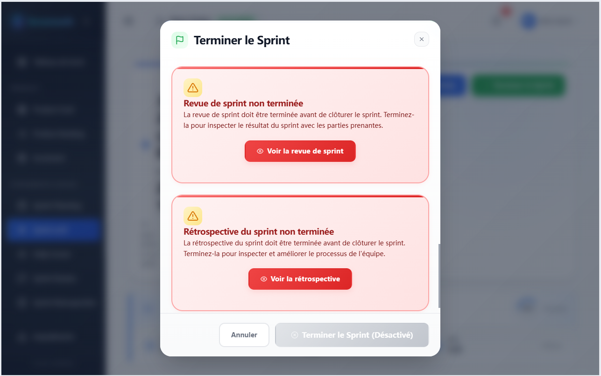

# Scrumooth — le Scrum Guide, appliqué.

**Jugez un outil Scrum sur les règles qu'il fait respecter, non sur les tableaux qu'il dessine.**

**Scrumooth** est une application web auto-hébergée et open source destinée aux équipes qui pratiquent Scrum. Elle est conçue pour les Scrum Masters, les Product Owners et les équipes pilotées par l'ingénierie qui veulent que le processus se tienne au Guide. Elle transforme les règles du **Scrum Guide 2020** en barrières que le backend fait respecter partout où un outil le peut — et déclare les endroits où elle ne le fait délibérément pas.

Elle **ne remplace pas** votre outil de suivi des tickets. En tant que couche d'application du Scrum Guide que votre outil n'a pas, elle est responsable du cycle de vie du Sprint, des rôles et des barrières, et elle refuse qu'une violation du processus passe sous silence. Votre outil conserve votre enregistrement ; Scrumooth conserve vos règles. Chaque règle qu'elle applique est résumée dans [Ce que Scrumooth applique](#what-scrumooth-enforces) et cataloguée code par code dans le [catalogue des refus](docs/api/README.md#gate-rejections) — et aucune règle en dehors de ce catalogue n'est revendiquée.

Faire tourner un second outil a un coût réel — quelque chose de plus à déployer, sécuriser, sauvegarder et maintenir. Scrumooth est délibérément le plus petit système capable de le porter : une seule pile Compose —proxy inverse, backend, frontend, PostgreSQL et sauvegardes planifiées— et une seule base de données à surveiller.

> **Langues :** [English](README.md) | [Deutsch](README.de.md) | [Español](README.es.md) | [Français](README.fr.md) | [Italiano](README.it.md)

[](https://opensource.org/licenses/Apache-2.0)
[](https://github.com/orbivort/scrumooth/actions/workflows/ci.yml)
[](https://codecov.io/github/orbivort/scrumooth)
[](https://github.com/orbivort/scrumooth/releases)
[](https://github.com/orbivort/scrumooth/issues)

[](https://www.typescriptlang.org/)
[](https://nodejs.org/)
[](https://www.postgresql.org/)

<p align="center">
  
</p>

<a id="live-demo"></a>

## 🖥️ Démo en ligne

Essayez Scrumooth instantanément dans votre navigateur — aucune installation requise. La démo s'exécute avec des données simulées (aucun backend nécessaire), ce qui vous permet d'explorer immédiatement l'ensemble du cycle de vie Scrum.

<p align="center">
  <a href="https://orbivort.github.io/scrumooth/" target="_blank" rel="noopener noreferrer">
    <strong>👉 Lancer la démo en ligne sur GitHub Pages</strong>
  </a>
</p>

> **Remarque :** La démo s'exécute entièrement dans votre navigateur, sur un univers fictif de personnes, d'équipes et de produits inventés — aucun nom réel, employeur ou donnée n'y apparaît. Connectez-vous en un clic depuis les cartes de personas de la page de connexion, puis choisissez un rôle pour voir ce que ce rôle peut faire (une personne détient délibérément un rôle différent dans chaque équipe). Les requêtes sont traitées par un backend simulé, de sorte que toute modification que vous apportez ne dure que le temps de votre session et est réinitialisée au rafraîchissement. Pour des données persistantes et une collaboration multi-utilisateurs, suivez le guide d'[Installation](#installation) afin d'auto-héberger votre propre instance.

---

## Table des matières

**Comprendre Scrumooth**

- [Démo en ligne](#live-demo)
- [Le manifeste](#the-manifesto)
- [Ce que Scrumooth applique](#what-scrumooth-enforces)
- [À qui elle s'adresse](#who-its-for)
- [Pourquoi vous pouvez lui faire confiance](#why-you-can-trust-it)
- [Fonctionnalités](#features)

**Auto-hébergement et développement**

- [Pile technologique](#tech-stack)
- [Structure du projet](#project-structure)
- [Démarrage rapide](#quick-start)
- [Prérequis](#prerequisites)
- [Installation](#installation)
- [Commandes de développement courantes](#development-commands)
- [Tests](#testing)
- [Tests de charge (k6)](#load-testing-k6)
- [Qualité du code](#code-quality)
- [Gestion de la base de données](#database-management)
- [Prise en charge de Docker](#docker-support)
- [Déploiement](#deployment)
- [Dépannage](#troubleshooting)

**Projet**

- [Documentation](#documentation)
- [Feuille de route](#roadmap)
- [Contribuer](#contributing)
- [Licence](#license)

---

<a id="the-manifesto"></a>

## 📜 Le manifeste — Pourquoi Scrumooth existe

> La plupart des outils de gestion de projet sont conçus pour **enregistrer** ce qui s'est passé. Ils vous fournissent des tableaux, ils consignent vos clics, ils dessinent des graphiques précis —une fois le Sprint terminé. Enregistrer est réellement utile, et ces outils le font bien.
>
> Mais un enregistrement est une description, pas une décision. Le Scrum Guide 2020 regorge de règles auxquelles un outil pourrait vous tenir : un Sprint ne se clôture qu'après son Sprint Review et sa Sprint Retrospective, seuls les Developers estiment le travail, un seul Product Owner possède le Product Backlog, et « Done » signifie que la Definition of Done a été satisfaite. Quand l'une d'elles passe entre les mailles —un Sprint clôturé avant que sa Sprint Retrospective n'ait eu lieu, un Product Owner estimant le travail au nom des Developers, un élément marqué Done sans que ses critères aient été vérifiés—, cet écart reste généralement invisible jusqu'à la fin du Sprint. Dans la plupart des outils, ces règles sont indicatives : une compréhension partagée dont on fait confiance à l'équipe pour se souvenir.
>
> **Scrumooth les traite comme des règles.**
>
> La discipline n'est pas l'ingrédient manquant —si elle suffisait à elle seule, aucune équipe n'aurait jamais clôturé un Sprint sans sa Sprint Retrospective. Le Guide dit à une équipe quoi faire ; il ne peut pas remarquer quand l'équipe cesse de le faire. C'est pourquoi nous intégrons le **Scrum Guide 2020** sous forme de code exécutable et le **faisons respecter** côté serveur, là où ni l'interface ni un appel direct à l'API ne peuvent le contourner. Nous sommes un **gardien, pas un preneur de notes**.
>
> Moins de débats sur les processus. Plus de temps à livrer des logiciels fonctionnels.

<a id="what-scrumooth-enforces"></a>

## 🔒 Ce que Scrumooth applique

Ce sont des barrières, pas des avertissements ni des suggestions. Dans tous les cas ci-dessous, la réponse est non — et chaque réponse tient dans la couche de service du backend, de sorte qu'un raccourci côté frontend ne peut pas la contourner.

Chacun est un refus distinct que le backend peut renvoyer, et le contrat en compte **68** : 39 barrières du Guide, 5 barrières de pratiques complémentaires et 24 barrières d'intégrité du processus — comptées à partir de ce contrat unique et vérifiées en CI, de sorte que les totaux ici ne peuvent pas diverger de ce que le code applique.

Les tableaux ci-dessous regroupent les barrières par ce qu'elles protègent et nomment la règle phare que chacune applique. Le **catalogue complet, code par code** — chaque code de refus `GATE_*` avec le statut HTTP avec lequel il est renvoyé — se trouve dans le [catalogue des refus](docs/api/README.md#gate-rejections), qui est la source de vérité unique. Cette section est une visite guidée de ce catalogue, et non un substitut.

| Une règle du Scrum Guide 2020, posée comme une question                                                                   | La réponse de Scrumooth                                                                                                                                                                                                                                                                                                    |
| ------------------------------------------------------------------------------------------------------------------------- | -------------------------------------------------------------------------------------------------------------------------------------------------------------------------------------------------------------------------------------------------------------------------------------------------------------------------- |
| Un Sprint peut-il être clôturé avant son Sprint Review et sa Sprint Retrospective ?                                       | La clôture du Sprint est refusée tant que les deux événements ne sont pas enregistrés ([API sprints](docs/api/sprints.md)).                                                                                                                                                                                                |
| Un élément peut-il être déclaré Done sans sa Definition of Done ?                                                         | Terminer un Sprint ne marque jamais les éléments comme Done — chaque élément doit franchir sa liste de contrôle de la Definition of Done ([API Definition of Done](docs/api/definition-of-done.md)).                                                                                                                       |
| Une équipe peut-elle avoir plus d'un Product Owner ou plus d'un Scrum Master ?                                            | L'ajout d'un second titulaire de l'un ou l'autre rôle est refusé ([API teams](docs/api/teams.md)).                                                                                                                                                                                                                         |
| Une équipe peut-elle dépasser la taille d'une Scrum Team ?                                                                | La taille de l'équipe est plafonnée — `TEAM_MAX_SIZE`, par défaut `10` ([API teams](docs/api/teams.md)).                                                                                                                                                                                                                   |
| Deux équipes sur un même produit peuvent-elles avoir deux Definitions of Done ?                                           | Non : un groupe d'équipes possède une seule Definition of Done que ses équipes lisent, une équipe regroupée ne peut pas modifier la sienne, et l'adhésion enregistre la version adoptée ([API Team Groups](docs/api/team-groups.md)).                                                                                      |
| Quelqu'un d'autre qu'un Developer peut-il estimer le travail ?                                                            | Seuls les Developers peuvent estimer les éléments du Product Backlog — tout autre rôle reçoit `403 Forbidden` ([API Product Backlog](docs/api/product-backlog.md)).                                                                                                                                                        |
| Le Product Owner ou le Scrum Master peuvent-ils rédiger le Daily Scrum ?                                                  | Seuls les Developers peuvent rédiger ou rejoindre l'enregistrement quotidien ; le Product Owner et le Scrum Master observent ([API Daily Scrum](docs/api/daily-scrum.md)).                                                                                                                                                 |
| Un Sprint peut-il être annulé par quelqu'un d'autre que le Product Owner ?                                                | L'annulation est réservée au Product Owner, et uniquement tant que le Sprint est `ACTIVE` ([API sprints](docs/api/sprints.md)).                                                                                                                                                                                            |
| Un Increment livré peut-il être réécrit ?                                                                                 | Les Increments livrés et archivés sont terminaux — ni l'un ni l'autre ne peut être réécrit, relivré ou réactivé ([API increments](docs/api/increments.md)).                                                                                                                                                                |
| La Definition of Done peut-elle être vidée ?                                                                              | Une Definition of Done doit conserver au moins un élément actif ; un Sprint Backlog ne peut pas être engagé, et un Sprint ne peut pas démarrer, tant qu'une équipe n'en a aucune ; et un travail ne peut pas être marqué Done tant qu'une équipe n'en a aucune ([API Definition of Done](docs/api/definition-of-done.md)). |
| Un Increment peut-il être marqué utilisable, ou livré, sans preuve ?                                                      | Un Increment doit être attesté utilisable par écrit — avec qui l'a attesté et quand — avant de pouvoir être vérifié ou livré ([API increments](docs/api/increments.md)).                                                                                                                                                   |
| Quelqu'un en dehors de l'équipe peut-il lire ou livrer un Increment ?                                                     | Un Increment appartient à sa Scrum Team : le lire, le vérifier ou le livrer exige d'en être membre ([API increments](docs/api/increments.md)).                                                                                                                                                                             |
| Un Increment peut-il omettre en silence un travail arrivé à Done ?                                                        | La composition rapporte son résultat (composé, ignoré avec une raison, ou échoué), et l'Increment d'un Sprint peut être réconcilié à partir de ses éléments Done ([API increments](docs/api/increments.md)).                                                                                                               |
| Un Sprint peut-il être clôturé alors qu'il a encore des Impediments non résolus ?                                         | Non : un Sprint ne peut pas être terminé tant qu'un Impediment est encore `OPEN` ou `IN_PROGRESS`, et les deux états terminaux d'un Impediment exigent une résolution écrite ([API impediments](docs/api/impediments.md), [API sprints](docs/api/sprints.md)).                                                             |
| Le Sprint Review ou la Sprint Retrospective peuvent-ils se dérouler dans le désordre, ou avant la date de fin du Sprint ? | Non : la Sprint Retrospective ne peut pas se terminer avant son Sprint Review, et aucun des deux événements ne peut se terminer avant le jour que nomme la date de fin du Sprint ([API sprint reviews](docs/api/sprint-reviews.md), [API retrospectives](docs/api/retrospectives.md)).                                     |
| Le Sprint Goal peut-il changer, ou le Sprint Backlog s'en écarter, une fois le Sprint lancé ?                             | Non : le Goal est verrouillé une fois le Sprint lancé, et un changement qui met le Goal en péril reste en attente jusqu'à ce que le Product Owner en accuse réception ([API sprints](docs/api/sprints.md)).                                                                                                                |
| L'enregistrement du Daily Scrum peut-il omettre ce qu'il a adapté ?                                                       | Non : un enregistrement doit déclarer au moins un ajustement du Sprint Backlog, ou reconnaître explicitement qu'aucun n'était nécessaire ([API daily scrum](docs/api/daily-scrum.md)).                                                                                                                                     |
| Un Sprint peut-il durer plus d'un mois, chevaucher un autre Sprint, ou démarrer après une interruption ?                  | Non : un Sprint peut couvrir au plus `SPRINT_MAX_DURATION_DAYS`, une équipe mène un seul Sprint à la fois, et un nouveau Sprint démarre immédiatement après le précédent ([API sprints](docs/api/sprints.md)).                                                                                                             |
| Le Sprint Backlog peut-il être créé sans toute la Scrum Team ?                                                            | Non : un Sprint ne peut pas démarrer à moins que la présence à la planification soit enregistrée et inclue le Product Owner et au moins un Developer, et à moins que le plan corresponde à la capacité enregistrée ([API sprints](docs/api/sprints.md)).                                                                   |
| Quelqu'un d'autre que le Product Owner peut-il ordonner le Product Backlog ?                                              | Non : l'ordre du backlog et la bande MoSCoW relèvent de la seule décision du Product Owner ([API Product Backlog](docs/api/product-backlog.md)).                                                                                                                                                                           |
| Une équipe peut-elle poursuivre plus d'un Product Goal, ou laisser le travail du backlog s'en éloigner ?                  | Non : un seul Product Goal `ACTIVE` à la fois ; les éléments y sont ancrés ; le Goal est réservé au Product Owner et ne peut pas se terminer sans preuve enregistrée ([API Product Goals](docs/api/product-goals.md)).                                                                                                     |
| Un Sprint peut-il démarrer sans Product Goal ?                                                                            | Non : un Sprint ne peut pas démarrer tant qu'il n'est pas lié à un Product Goal ([API sprints](docs/api/sprints.md)).                                                                                                                                                                                                      |
| Un Increment peut-il être vérifié avant de s'intégrer aux Increments précédents ?                                         | Non : « additif à tous les Increments précédents et soigneusement vérifié » est contrôlé avant qu'un Increment puisse être `VERIFIED` ou livré ([API increments](docs/api/increments.md)).                                                                                                                                 |
| Un Increment peut-il être livré par une simple écriture de statut ?                                                       | Non : `DELIVERED` n'est atteignable que par l'action de livraison, qui enregistre comment la valeur a atteint les utilisateurs ([API increments](docs/api/increments.md)).                                                                                                                                                 |
| Une amélioration de Retrospective peut-elle être dissociée en silence ?                                                   | Non : dès qu'une amélioration a produit, ou a été liée à, un élément du Product Backlog, ce lien est la preuve qu'elle a été traitée et ne peut pas être effacé ([API retrospectives](docs/api/retrospectives.md)).                                                                                                        |
| Un Sprint Review peut-il se terminer sans juger le Sprint Goal ?                                                          | Non : un Sprint Review d'un Sprint qui a un Goal ne peut pas se terminer sans le verdict enregistré de l'équipe, et un Sprint sans Goal ne peut pas en porter du tout ([API sprint reviews](docs/api/sprint-reviews.md)).                                                                                                  |

### Pratiques complémentaires que Scrumooth applique également

Ce ne sont **pas des règles du Scrum Guide 2020** — les trois artefacts du Guide sont le Product Backlog, le Sprint Backlog et l'Increment, et la Definition of Ready n'en fait partie d'aucun. Ce sont les ajouts propres au produit, étiquetés comme tels dans l'interface, et ils sont listés ici séparément pour que le tableau ci-dessus continue de signifier exactement ce qu'il dit.

| Une pratique que Scrumooth applique, posée comme une question                                                   | La réponse de Scrumooth                                                                                                                                                                                                                                                                                                                                                             |
| --------------------------------------------------------------------------------------------------------------- | ----------------------------------------------------------------------------------------------------------------------------------------------------------------------------------------------------------------------------------------------------------------------------------------------------------------------------------------------------------------------------------- |
| Une équipe peut-elle convenir de ce que signifie « ready », puis planifier quand même ?                         | Non : la Definition of Ready de l'équipe est appliquée à la frontière du Sprint. Engager un Sprint Backlog ou démarrer un Sprint est refusé tant qu'un élément sélectionné a encore un critère de disponibilité actif non vérifié — le refus nomme les éléments — et refusé tant que l'équipe n'a aucun critère actif ([API Definition of Ready](docs/api/definition-of-ready.md)). |
| Un Sprint Backlog peut-il inclure un élément qui n'a pas été raffiné jusqu'à « ready » ?                        | Non : un élément doit être raffiné jusqu'à `READY` avant de pouvoir entrer dans un Sprint — au moment de la planification exactement comme lorsqu'il est ajouté en cours de Sprint ([API Product Backlog](docs/api/product-backlog.md)).                                                                                                                                            |
| Qui maintient l'accord de disponibilité ?                                                                       | Le Scrum Master de l'équipe, seul. L'accord de disponibilité est la pratique déclarée d'un seul rôle plutôt que l'engagement partagé de la Scrum Team, il appartient donc au Scrum Master de le façonner ou de le retirer ([API Definition of Ready](docs/api/definition-of-ready.md)).                                                                                             |
| Quelqu'un en dehors de l'équipe peut-il lire l'accord de disponibilité, ou enregistrer un verdict à son sujet ? | Non : le lire ou enregistrer une vérification de disponibilité exige d'être membre de l'équipe qui le détient ([API Definition of Ready](docs/api/definition-of-ready.md)).                                                                                                                                                                                                         |

Deux conséquences méritent d'être énoncées clairement. Comme il s'agit d'une règle du produit et non d'une règle du Guide, une équipe qui ne veut pas de Definition of Ready la rencontre quand même : Scrumooth crée six critères par défaut pertinents la première fois que l'accord est lu, et le Scrum Master de l'équipe peut les façonner ou les retirer. Et comme refuser un Sprint à cause d'un artefact hors Guide est un vrai compromis, la liste de contrôle dit ce qu'il est dans ses propres termes — une pratique complémentaire, non un artefact du Guide — plutôt que d'emprunter l'autorité du Guide.

### Barrières d'intégrité du processus et de transparence

Une troisième classe n'est ni une barrière du Guide ni une pratique complémentaire, mais la lecture par le produit de la transparence et de l'autogestion du Guide : le travail d'une Scrum Team appartient à cette équipe, et les contenus francs appartiennent au rôle qui en est responsable. Ils sont listés séparément pour la même raison que les pratiques ci-dessus.

| Une limite que Scrumooth applique, posée comme une question                                       | La réponse de Scrumooth                                                                                                                                                                                                                                                                                                                                                                                      |
| ------------------------------------------------------------------------------------------------- | ------------------------------------------------------------------------------------------------------------------------------------------------------------------------------------------------------------------------------------------------------------------------------------------------------------------------------------------------------------------------------------------------------------ |
| Quelqu'un en dehors de l'équipe peut-il lire ou modifier les artefacts d'une équipe ?             | Non : un Sprint, un Impediment, une Definition of Done, un Increment, un Sprint Review, une Sprint Retrospective, un bilan des valeurs Scrum, une barrière organisationnelle, un rapport et les accords de travail de l'équipe sont chacun circonscrits à l'équipe qui les détient — les lire ou les écrire exige d'être membre de cette équipe ([catalogue des refus](docs/api/README.md#gate-rejections)). |
| Quelqu'un d'autre que le Scrum Master peut-il lire ou écrire le matériel propre au Scrum Master ? | Non : les notes du Scrum Master sur un Sprint, un Sprint Review et une Sprint Retrospective, le journal de coaching, l'évaluation de la plurifonctionnalité, les résultats d'un bilan des valeurs et l'accord de disponibilité lui appartiennent en propre ([catalogue des refus](docs/api/README.md#gate-rejections)).                                                                                      |
| Un Impediment peut-il être escaladé en barrière deux fois, ou par une autre équipe ?              | Non : une seule barrière par Impediment, levée uniquement par l'équipe qui a levé l'Impediment, et seul le Scrum Master de l'équipe peut la lever, la modifier, la résoudre ou la clôturer — un état terminal exige une résolution écrite ([API Organizational Barriers](docs/api/organizational-barriers.md)).                                                                                              |
| Une équipe peut-elle changer la Definition of Done partagée qui la régit sans sa direction ?      | Non : rejoindre ou quitter un groupe décide de l'engagement auquel l'équipe est tenue, c'est donc la décision du Product Owner ou du Scrum Master de l'équipe ; une équipe appartient à au plus un groupe, et un groupe qui compte encore des équipes ne peut pas être supprimé sous leurs pieds ([API Team Groups](docs/api/team-groups.md)).                                                               |

**Là où Scrumooth n'applique délibérément rien :** la Prime Directive de la Sprint Retrospective reste du ressort de la facilitation, et les timeboxes des événements sont rendues visibles par un minuteur d'équipe partagé plutôt que de mettre fin à un événement de force. Le Guide demande l'autogestion exactement à ces endroits, Scrumooth ne décide donc pas à la place de l'équipe.

**À quoi ressemble une barrière en pratique.** C'est vendredi, le Sprint doit se terminer, l'Increment est déployé — et la Sprint Retrospective n'a jamais été planifiée. Un outil d'enregistrement clôture le Sprint et la Sprint Retrospective glisse à la semaine suivante, ce qui est l'échec que le dernier événement du Guide existe pour prévenir ; Scrumooth refuse la clôture tant que les deux événements ne sont pas enregistrés. L'équipe tient alors sa Sprint Retrospective, ou s'arrête et débat de la raison de ne pas le faire —la version de cette décision que le Guide attend d'une équipe qu'elle prenne consciemment.

Pourquoi les outils que vous utilisez déjà n'ajouteraient-ils pas simplement cela ? À notre avis, parce qu'une barrière que l'on peut désactiver est un réglage, pas une règle, et que la configurabilité est leur argument de vente et non leur omission. Pas plus qu'un service hébergé ne peut facilement promettre que vos données de processus ne quitteront jamais votre infrastructure. Scrumooth n'est pas une fonctionnalité qui leur manque ; c'est un compromis qu'ils ont déjà tranché dans l'autre sens.

Les tableaux ci-dessus constituent la revendication sur le Scrum Guide 2020, regroupés par ce qu'ils protègent, et le [catalogue des refus](docs/api/README.md#gate-rejections) est le catalogue complet, code par code, de chaque refus que Scrumooth peut renvoyer. Si une règle n'y est pas appliquée, Scrumooth ne l'applique pas — et comme une configuration qui enfreint le Guide n'est jamais proposée, **le refus est le produit.** Les pratiques complémentaires et les barrières d'intégrité du processus sont des ajouts propres au produit, maintenus dans des tableaux séparés et étiquetés afin que les trois ne puissent jamais être confondus l'un avec l'autre — la classe de chaque barrière est déclarée à côté du contrat, de sorte que la séparation est vérifiée en CI plutôt qu'affirmée ici.

<a id="who-its-for"></a>

## 🎯 À qui elle s'adresse

**Scrumooth est conçue pour une situation en particulier :** les organisations pilotées par l'ingénierie qui doivent pouvoir démontrer comment un Sprint a réellement été mené, et pour lesquelles les données de processus ne peuvent pas quitter leur propre infrastructure — secteurs réglementés, leurs fournisseurs et équipes du secteur public.

**Scrumooth est faite pour vous si…**

- Vous êtes **Scrum Master ou Product Owner**, votre équipe a du mal à tenir le Scrum Guide 2020, et vous voulez que l'outil refuse la dérive au lieu de la tolérer en silence.
- Vous dirigez une **équipe d'ingénierie** qui souhaite auto-héberger ses données de processus pour des raisons de confidentialité, de conformité ou de souveraineté des données.
- Vous avez besoin d'un **enregistrement défendable et auditable** de la manière dont chaque Sprint a réellement été mené — qui a modifié quoi, quand et sous quel rôle.
- Vous voulez que les limites du Scrum Guide soient codées une fois pour toutes, afin que les nouveaux membres de l'équipe apprennent le processus en l'utilisant.

**Scrumooth n'est pas faite pour vous si…**

- Vous cherchez un outil de suivi des tickets généraliste, un planificateur de feuille de route ou un tableau Kanban pour du travail hors Scrum. Scrumooth refuse d'être l'un d'eux.
- Vous voulez que chaque règle soit configurable. Scrumooth refuse les configurations qui enfreignent le Scrum Guide.
- Vous voulez un SaaS entièrement géré. Scrumooth est auto-hébergée par conception.
- Vous avez besoin d'une gestion de portefeuille, d'une planification des ressources ou d'un suivi financier poussés sur de nombreux projets sans lien entre eux.
- Vous suivez un framework à l'échelle qui adapte le Guide pour une organisation plus large, ou Scrum n'est pas encore la façon de travailler de votre équipe. Scrumooth applique le Scrum Guide 2020 tel qu'écrit, pour une seule Scrum Team.

<a id="why-you-can-trust-it"></a>

## 🛡 Pourquoi vous pouvez lui faire confiance

**Pourquoi pas un service hébergé**

- **Auto-hébergée par conception.** Vos données de processus ne quittent jamais votre infrastructure.
- **Souveraineté des données intégrée.** L'export de données RGPD, un délai de grâce de 14 jours avant suppression et le suivi du consentement sont inclus dans le produit.
- **Auditable.** Chaque changement de rôle et chaque transition d'état sont consignés dans un journal d'audit dédié et séparé pour la conformité.
- **Accès borné.** Les sessions simultanées sont plafonnées et les plus anciennes sont révoquées automatiquement.

**Pourquoi pas un autre outil auto-hébergé**

- **Ouverte et inspectable.** Apache-2.0, CI publique, couverture publiée — une **barrière de 80 % sur les lignes, branches, fonctions et instructions** est appliquée dans la chaîne d'intégration.
- **Testée sous charge, pas seulement en tests unitaires.** 10 scénarios k6 préconstruits, dont un pic de Sprint Planning. Voir [Tests de charge](#load-testing-k6).
- **Stricte par construction.** Mode strict TypeScript sur le backend, le frontend et les paquets partagés.
- **Localisée là où cela compte.** L'interface est disponible en anglais, allemand, espagnol, français et italien, avec une terminologie Scrum issue du Scrum Guide officiel.

**Pour celles et ceux qui doivent l'approuver en interne.** Le guide de déploiement, l'architecture de sécurité et le processus de signalement des vulnérabilités sont documentés dans le dépôt : [Déploiement](#deployment), [`docs/architecture/security-architecture.md`](docs/architecture/security-architecture.md) et [`SECURITY.md`](SECURITY.md).

<a id="features"></a>

## ✨ Fonctionnalités

### Le flux de travail Scrum

Tout ce qu'il faut pour mener le Sprint — les cinq événements, trois artefacts et trois engagements du Guide — avec la règle qu'il porte attachée à chacun. Les clauses en gras reprennent les barrières de [Ce que Scrumooth applique](#what-scrumooth-enforces) ; le catalogue complet est le [catalogue des refus](docs/api/README.md#gate-rejections).

- **Product Goal** - Alignement stratégique et suivi des objectifs ; l'engagement au service du backlog ; **seul le Product Owner en crée ou en modifie un, un seul peut être `ACTIVE` à la fois, et il ne peut pas se terminer sans preuve enregistrée**
- **Product Backlog** - Priorisation MoSCoW (Must, Should, Could, Won't) ; **seuls les Developers estiment le travail, et seul le Product Owner l'ordonne et fixe sa bande**
- **Sprint Planning** - Durées de Sprint configurables et planification de la capacité ; **seuls les Developers enregistrent le Sprint Backlog**, un Sprint ne peut pas démarrer tant que la présence à la planification n'est pas enregistrée avec le Product Owner et un Developer, et aucun élément n'entre dans le Sprint avant d'être raffiné jusqu'à `READY`
- **Sprint Execution** - Tableau Kanban interactif avec glisser-déposer ; **seul le Product Owner peut annuler, et uniquement tant que le Sprint est `ACTIVE`** ; le Sprint Goal est verrouillé une fois lancé, et un changement qui met le Goal en péril attend l'accusé de réception du Product Owner
- **Daily Scrum** - Enregistrement quotidien partagé, avec remontée des Impediments ; **seuls les Developers le rédigent — le Product Owner et le Scrum Master observent** ; un enregistrement doit déclarer ce qu'il a adapté, ou que rien n'avait besoin d'être adapté
- **Impediment** - Identification des blocages et suivi de leur résolution, avec priorisation par impact (Critique/Élevé/Moyen/Faible) et dates cibles ; **un Sprint ne peut pas être clôturé avant que ses Impediments soient résolus**, les deux états terminaux exigent une résolution écrite, chaque écriture est circonscrite à l'équipe qui a levé l'Impediment, et un Impediment sans responsable revient au Scrum Master — qui est notifié quand l'un dépasse le seuil d'escalade
- **Increment** - Gestion des Increments du produit ; **dès qu'un élément du Product Backlog satisfait la Definition of Done, un Increment naît** ; un Increment n'est vérifié qu'après s'être intégré à chaque Increment précédent, attesté utilisable par écrit avant de pouvoir être vérifié ou livré, et livré uniquement avec une méthode de livraison enregistrée
- **Sprint Review** - Gestion de la revue, retours des parties prenantes et ajustement du backlog ; **un Sprint ne peut pas être clôturé avant que son Sprint Review ne soit enregistré** ; le Sprint Review ne peut pas se terminer avant la date de fin du Sprint, un Sprint avec un Goal ne peut pas se terminer sans le verdict de l'équipe elle-même à son sujet, et un Sprint sans Goal ne peut pas en porter du tout
- **Sprint Retrospective** - Réflexion d'équipe et amélioration suivie ; **un Sprint ne peut pas être clôturé avant que sa Sprint Retrospective ne soit enregistrée** ; elle ne peut pas se terminer avant son Sprint Review, appliquer des changements à la Definition of Done exige une réflexion enregistrée, et une amélioration déjà liée à un élément du Product Backlog ne peut pas être dissociée

### Gouvernance et exploitation

- **Moteur de workflow** - Autorisations basées sur les rôles et transitions d'état contrôlées, **appliquées côté serveur**
- **Definition of Done/Ready** - Listes de contrôle personnalisables ; **rien n'est Done tant que sa liste de contrôle n'est pas franchie**, l'accord de disponibilité est à maintenir par le Scrum Master de l'équipe, et une équipe dans un groupe est régie par l'unique Definition of Done du groupe
- **Intégrité des Increments** - **Le travail livré ne peut pas être réécrit en silence**

### Équipe et organisation

- **Composition de l'équipe** - Un Product Owner et un Scrum Master ; **taille de l'équipe plafonnée** (`TEAM_MAX_SIZE`, par défaut `10`)
- **Team Groups** - Plusieurs Scrum Teams sur un même produit partagent une Definition of Done ; **une équipe regroupée ne peut pas modifier la sienne, l'adhésion enregistre la version adoptée, et seule la direction d'une équipe peut rejoindre ou quitter un groupe**
- **Journalisation d'audit** - Journal dédié et séparé pour la conformité ; **chaque changement de rôle et chaque transition d'état enregistrés**
- **Tableau de bord et rapports** - Métriques et visualisations en temps réel ; **chaque rapport est circonscrit à l'équipe dont il décrit l'historique**
- **Communication d'équipe** - Notifications et messagerie intégrées
- **Team Health Check** - Point périodique sur les cinq valeurs Scrum ; **les résultats ne sont lisibles que par le Scrum Master de l'équipe**
- **Organizational Barriers** - Le registre de ce qui bloque une équipe depuis l'extérieur et des actions menées pour y remédier ; **seul le Scrum Master de l'équipe peut en lever, modifier, résoudre ou clôturer une, et la clôture exige une résolution écrite**
- **Facilitation** - Le journal de coaching du Scrum Master, les accords de travail de l'équipe et l'évaluation de la plurifonctionnalité ; **les contenus francs appartiennent au Scrum Master et les accords de l'équipe à l'équipe**
- **Timeboxes d'événements partagées** - Une horloge pour tous les participants ; **les timeboxes sont affichées, jamais closes de force**
- **Contrôles de confidentialité** - Droits d'export et d'effacement des données, plus suivi du consentement

<a id="tech-stack"></a>

## 🛠 Pile technologique

### Backend

- **Runtime :** Node.js 24+
- **Framework :** Express.js 5
- **Langage :** TypeScript (mode strict)
- **Base de données :** PostgreSQL 18+ avec Prisma ORM 7
- **Authentification :** JWT avec bcrypt
- **Validation :** Zod
- **Tâches planifiées :** node-cron
- **E-mail :** Nodemailer (fournisseurs SMTP, SendGrid, AWS SES)
- **Journalisation :** Winston avec transports de fichiers rotatifs

### Frontend

- **Framework :** React 19 avec Vite
- **Langage :** TypeScript (mode strict)
- **Routage :** React Router 8
- **Gestion d'état :** TanStack Query (React Query) + Zustand
- **Visualisation :** Chart.js
- **Styles :** CSS Modules avec Design Tokens
- **Suivi des erreurs :** Sentry (optionnel, via `VITE_SENTRY_DSN`)

### Partagé

- Types et interfaces TypeScript
- Constantes et énumérations
- Fonctions utilitaires

### Tests et qualité

- **Unitaires / Intégration :** Vitest
- **End-to-End :** Playwright (frontend) + Vitest (backend)
- **Tests de charge :** k6 (10 scénarios préconstruits)
- **Linting :** ESLint + Stylelint
- **Formatage :** Prettier
- **Git Hooks :** Husky + lint-staged

<a id="project-structure"></a>

## 📁 Structure du projet

```
scrumooth/
├── packages/
│   ├── backend/              # API REST Express.js
│   │   ├── src/
│   │   │   ├── controllers/  # Gestionnaires de routes API
│   │   │   ├── services/     # Couche de logique métier
│   │   │   ├── middleware/   # Middleware Express
│   │   │   ├── routes/       # Définitions des routes API
│   │   │   ├── utils/        # Fonctions utilitaires
│   │   │   └── __tests__/    # Tests unitaires, d'intégration et e2e
│   │   ├── prisma/           # Schéma de base de données et migrations
│   │   ├── Dockerfile        # Image de production
│   │   └── Dockerfile.dev    # Image de développement
│   ├── frontend/             # Frontend React + Vite
│   │   ├── src/
│   │   │   ├── components/   # Composants React
│   │   │   ├── pages/        # Pages au niveau des routes
│   │   │   ├── hooks/        # Hooks React personnalisés
│   │   │   ├── services/     # Services client API
│   │   │   ├── stores/       # Stores Zustand
│   │   │   └── styles/       # CSS et design tokens
│   │   ├── e2e/              # Tests end-to-end Playwright
│   │   ├── Dockerfile        # Image de production
│   │   └── Dockerfile.dev    # Image de développement
│   └── shared/               # Types, constantes et utilitaires partagés
├── docs/
│   ├── api/                  # Référence de l'API REST
│   ├── architecture/         # Conception système, modèle de données, sécurité
│   ├── deployment/           # Guides de déploiement
│   └── user-guide/           # Documentation utilisateur et guides
├── k6/                       # Scénarios de tests de charge (k6)
│   └── scripts/scenarios/    # scénarios de tests de charge préconstruits
├── scripts/                  # Scripts de build et utilitaires
├── .github/workflows/        # CI, Release et déploiement GitHub Pages
├── docker-compose.yml        # Docker Compose de production
├── docker-compose.dev.yml    # Docker Compose de développement
├── CHANGELOG.md              # Historique des versions
├── SECURITY.md               # Politique de sécurité et signalement
├── CONTRIBUTING.md           # Directives de contribution
├── CODE_OF_CONDUCT.md        # Code de conduite de la communauté
└── THIRD-PARTY-NOTICES.md    # Attributions de licences tierces
```

<a id="quick-start"></a>

## ⚡ Démarrage rapide

Le moyen le plus rapide d'exécuter une instance locale est d'utiliser Docker Compose :

```bash
git clone https://github.com/orbivort/scrumooth.git
cd scrumooth
cp packages/backend/.env.production.example packages/backend/.env.production
docker compose up -d
```

Cela démarre le proxy inverse Caddy, le backend, le frontend et PostgreSQL. Une fois en cours d'exécution, ouvrez <http://localhost> (HTTPS est activé par défaut sur le port 443). Pour une configuration manuelle complète (sans Docker), consultez [Installation](#installation).

> **Remarque :** Le stack Compose de production nécessite `packages/backend/.env.production`. Si vous préférez un environnement de développement entièrement préconfiguré avec rechargement à chaud, utilisez plutôt `docker compose -f docker-compose.dev.yml up`.

<a id="prerequisites"></a>

## 📋 Prérequis

- **Node.js** v24.19.0 ou supérieur
- **pnpm** v11.21.0 ou supérieur
- **PostgreSQL** v18 ou supérieur
- **Docker** et **Docker Compose** (optionnel, pour le démarrage rapide)

<a id="installation"></a>

## 🚀 Installation

### 1. Cloner le dépôt

```bash
git clone https://github.com/orbivort/scrumooth.git
cd scrumooth
```

### 2. Installer les dépendances

Ce projet utilise pnpm comme gestionnaire de paquets. Le projet impose pnpm via des scripts de préinstallation.

```bash
pnpm install
```

### 3. Configuration de l'environnement

Copiez les fichiers d'environnement d'exemple et configurez vos paramètres :

```bash
# Backend configuration
cp packages/backend/.env.example packages/backend/.env

# Frontend configuration
cp packages/frontend/.env.example packages/frontend/.env
```

Les deux fichiers d'exemple sont documentés en intégralité par leurs propres commentaires. Une exécution locale du backend ne nécessite que trois valeurs :

| Variable       | Objet                                                             |
| -------------- | ----------------------------------------------------------------- |
| `DATABASE_URL` | Chaîne de connexion PostgreSQL                                    |
| `JWT_SECRET`   | Clé de signature, au moins 64 caractères (`openssl rand -hex 64`) |
| `CORS_ORIGIN`  | L'origine du frontend, par ex. `http://localhost:5173`            |

Le frontend ne nécessite aucune configuration pour le développement local : `VITE_API_URL` se résout vers le proxy de développement.
Pour développer sans backend du tout, définissez `VITE_USE_MOCK_API=true` et exécutez `pnpm run dev:frontend` —
consultez [Développer sans backend](./CONTRIBUTING.md#developing-without-a-backend) et
[l'architecture des mocks](./docs/architecture/frontend-mock-architecture.md). Toutes les autres variables sont
listées dans [`packages/backend/.env.example`](packages/backend/.env.example) et
[`packages/frontend/.env.example`](packages/frontend/.env.example).

### 4. Configuration de la base de données

Générez le client Prisma, puis créez votre schéma de base de données. Pour le développement local, vous pouvez utiliser l'une ou l'autre approche :

```bash
# Generate Prisma client (always required)
pnpm run db:generate

# Option A: Push schema directly (fast iteration, no migration files)
pnpm run db:push

# Option B: Create and apply a migration (recommended for tracked changes)
pnpm run db:migrate
```

Pour les déploiements de production, utilisez `pnpm run db:migrate:prod` pour appliquer les migrations existantes sans invite interactive.

### 5. Démarrer le serveur de développement

```bash
pnpm run dev
```

Cela démarrera les serveurs backend et frontend simultanément. Pour les exécuter indépendamment :

```bash
pnpm run dev:backend    # Backend only (http://localhost:5001)
pnpm run dev:frontend   # Frontend only (http://localhost:5173)
```

<a id="development-commands"></a>

## 🛠 Commandes de développement courantes

Pour les développeurs, l'analogie la plus proche est un linter pour votre processus Scrum — avec la différence qui compte : un linter signale une infraction, une barrière la refuse.

Les commandes les plus courantes pour le développement quotidien :

| Tâche                           | Commande                |
| ------------------------------- | ----------------------- |
| Démarrer backend + frontend     | `pnpm run dev`          |
| Démarrer uniquement le backend  | `pnpm run dev:backend`  |
| Démarrer uniquement le frontend | `pnpm run dev:frontend` |
| Construire tous les paquets     | `pnpm run build`        |

<a id="testing"></a>

## 🧪 Tests

```bash
pnpm run test              # Tous les tests
pnpm run test:coverage     # Avec rapport de couverture
pnpm run test:unit         # Tests unitaires uniquement
pnpm run test:integration  # Tests d'intégration du backend
pnpm run test:e2e          # End-to-end (backend Vitest + frontend Playwright)
pnpm run test:watch        # Mode watch
```

Seuils de couverture imposés : **80 % de lignes, fonctions, instructions et branches**.

<a id="load-testing-k6"></a>

### Tests de charge (k6)

Les scénarios de tests de charge préconstruits se trouvent dans [`k6/scripts/scenarios/`](k6/scripts/scenarios). Copiez [`k6/.env.k6.example`](k6/.env.k6.example) vers `k6/.env.k6`, configurez votre cible, puis exécutez un scénario tel que :

```bash
pnpm run loadtest:normal    # Realistic everyday load
pnpm run loadtest:peak      # Sprint planning rush (worst-case concurrency)
pnpm run loadtest:stress    # Push the system until it breaks
```

> **Prérequis :** Installez [k6](https://k6.io/docs/get-started/installation/) et assurez-vous que votre backend cible est en cours d'exécution. Dix scénarios se trouvent dans [`k6/scripts/scenarios/`](k6/scripts/scenarios) ; les scripts `loadtest:*` de [`package.json`](package.json) en exposent huit, dont endurance, multi-team, daily-scrum, auth et database stress.

<a id="code-quality"></a>

## 🔍 Qualité du code

| Tâche                          | Commande             |
| ------------------------------ | -------------------- |
| Lint (ESLint)                  | `pnpm run lint`      |
| Lint et correction automatique | `pnpm run lint:fix`  |
| Lint CSS (Stylelint)           | `pnpm run lint:css`  |
| Formatage (Prettier)           | `pnpm run format`    |
| Vérification des types         | `pnpm run typecheck` |
| Audit de sécurité              | `pnpm run audit`     |

Consultez [`CONTRIBUTING.md`](CONTRIBUTING.md) pour le flux de travail de développement complet et les barrières qualité.

<a id="database-management"></a>

## 🗄 Gestion de la base de données

```bash
pnpm run db:generate     # Générer le client Prisma (après des changements de schéma)
pnpm run db:migrate      # Créer et appliquer une migration (développement)
pnpm run db:migrate:prod # Appliquer les migrations en production (non interactif)
pnpm run db:studio       # Ouvrir Prisma Studio (interface graphique de base de données)
```

Des commandes de base de données supplémentaires (`db:push`, `db:reset`, `db:validate`, `db:migrate:test`) sont documentées dans [`CONTRIBUTING.md`](CONTRIBUTING.md).

<a id="docker-support"></a>

## 🐳 Prise en charge de Docker

Le projet inclut une configuration Docker pour le développement et le déploiement en production.

### Utiliser Docker Compose

```bash
# Development environment (with hot reload)
docker compose -f docker-compose.dev.yml up

# Production environment (detached)
docker compose up -d

# Tear down
docker compose down
```

### Construire les images Docker manuellement

> **Remarque :** Tous les Dockerfiles référencent des chemins relatifs à la racine du dépôt (fichiers du workspace monorepo tels que `package.json`, `pnpm-lock.yaml` et `packages/shared/`). Vous devez les construire depuis la **racine du dépôt** et utiliser `-f` pour pointer vers le Dockerfile — passer le répertoire du paquet comme contexte de build échouera.

```bash
# Development images (with dev dependencies and watch mode)
docker build -t scrumooth-backend:dev -f packages/backend/Dockerfile.dev .
docker build -t scrumooth-frontend:dev -f packages/frontend/Dockerfile.dev .

# Production images (build from the repo root)
docker build -t scrumooth-backend -f packages/backend/Dockerfile .
docker build -t scrumooth-frontend -f packages/frontend/Dockerfile .
```

<details>
<summary>Utiliser un miroir registry/apt</summary>

Si vous êtes derrière un réseau qui nécessite un registry npm ou un miroir apt, vous pouvez les définir comme arguments de build ou variables d'environnement :

```bash
# Docker Compose
$env:NPM_REGISTRY="https://your_mirror_url"
$env:APT_MIRROR="your_mirror_url"

# Manual build
docker build --build-arg NPM_REGISTRY=https://your_mirror_url --build-arg APT_MIRROR=your_mirror_url .
```

</details>

<a id="deployment"></a>

## ☁️ Déploiement

### Production auto-hébergée

Consultez [`docs/deployment/DEPLOYMENT.md`](docs/deployment/DEPLOYMENT.md) pour un guide complet de déploiement en production, couvrant la configuration de l'environnement, la migration de la base de données, la configuration du proxy inverse et les bonnes pratiques opérationnelles.

### Déploiement de la démo sur GitHub Pages

La branche `main` est automatiquement déployée sur GitHub Pages via le workflow [`Deploy to GitHub Pages`](.github/workflows/deploy-github-pages.yml), en utilisant une **Mock API** en mémoire (aucun backend ni base de données requis). Consultez la [Démo en ligne](#live-demo) ci-dessus pour l'essayer.

<a id="documentation"></a>

## 📚 Documentation

| Domaine                     | Emplacement                                                                                                                            |
| --------------------------- | -------------------------------------------------------------------------------------------------------------------------------------- |
| **Guide utilisateur**       | [`docs/user-guide/`](docs/user-guide) — prise en main, fonctionnalités principales, flux de travail Scrum                              |
| **Référence API REST**      | [`docs/api/`](docs/api) — groupes d'endpoints couvrant l'authentification, les sprints, le backlog, les rapports et plus               |
| **Architecture système**    | [`docs/architecture/`](docs/architecture) — conception système, modèle de données, conception des composants, architecture de sécurité |
| **Guide de déploiement**    | [`docs/deployment/DEPLOYMENT.md`](docs/deployment/DEPLOYMENT.md)                                                                       |
| **Politique de sécurité**   | [`SECURITY.md`](SECURITY.md) — procédure de signalement des vulnérabilités                                                             |
| **Contribuer**              | [`CONTRIBUTING.md`](CONTRIBUTING.md) — directives et flux de travail de développement                                                  |
| **Code de conduite**        | [`CODE_OF_CONDUCT.md`](CODE_OF_CONDUCT.md) — normes de la communauté                                                                   |
| **Historique des releases** | [`CHANGELOG.md`](CHANGELOG.md)                                                                                                         |
| **Mentions tierces**        | [`THIRD-PARTY-NOTICES.md`](THIRD-PARTY-NOTICES.md)                                                                                     |

<a id="troubleshooting"></a>

## 🛟 Dépannage

### `Cannot find module @scrumooth/shared`

Le paquet partagé doit être construit avant que le backend/frontend puisse résoudre les imports.

```bash
pnpm --filter=@scrumooth/shared run build
```

Cela est normalement géré automatiquement par `pnpm install` et les scripts de développement, mais est nécessaire après un `pnpm run clean` manuel.

### `pnpm install` échoue avec « Use pnpm instead »

Le dépôt impose pnpm via un script `preinstall`. Installez pnpm globalement :

```bash
npm install -g pnpm@11.21.0
```

### Erreurs de connexion à la base de données au démarrage

Vérifiez que votre `DATABASE_URL` dans `packages/backend/.env` pointe vers une instance PostgreSQL 18+ en cours d'exécution et que la base de données existe. Exécutez `pnpm run db:validate` pour valider le schéma Prisma par rapport à la connexion.

### Port déjà utilisé (5001 ou 5173)

Les ports par défaut peuvent être remplacés via des variables d'environnement :

- Backend : `PORT` dans `packages/backend/.env`
- Frontend : `VITE_DEV_PORT` dans `packages/frontend/.env`

### Le frontend ne peut pas atteindre le backend

Vérifiez que `VITE_API_URL` dans `packages/frontend/.env` correspond à l'adresse réelle du backend et que `CORS_ORIGIN` dans `packages/backend/.env` autorise l'origine du frontend.

### Vous souhaitez développer sans backend ?

Définissez `VITE_USE_MOCK_API=true` dans `packages/frontend/.env` pour utiliser la même Mock API que celle qui alimente la démo en ligne.

<a id="roadmap"></a>

## 🗺 Feuille de route

Scrumooth est en développement actif. Les priorités ci-dessous approfondissent ce que Scrumooth applique plutôt que de l'élargir à un outil de suivi généraliste :

- [ ] **Rapport de conformité au Scrum Guide** — un état par Sprint des règles qui s'appliquaient et de la manière dont chacune a été satisfaite
- [ ] **Pack de preuves de Sprint exportable** — un enregistrement partageable pour les audits et les revues de conformité
- [ ] **Davantage de règles applicables** — les barrières du cycle de vie du Sprint, du Product Goal, des Team Groups, du bilan de santé et des barrières organisationnelles permettent désormais à une Scrum Team de mener de bout en bout les événements, artefacts et engagements du Guide ; l'extension de la surface couverte se poursuit
- [ ] **Automatisation plus poussée de la Definition of Done / Definition of Ready**
- [ ] **Des rapports qui font remonter la dérive du processus**, et pas seulement les métriques de livraison
- [ ] **Intégrations et webhooks**, pour que Scrumooth cohabite avec les outils que vous utilisez déjà
- [ ] Renforcement des performances et de l'évolutivité

L'état du projet et les dernières modifications sont suivis dans le [CHANGELOG](CHANGELOG.md). Les retours et les demandes de fonctionnalités sont les bienvenus via [GitHub Issues](https://github.com/orbivort/scrumooth/issues).

<a id="contributing"></a>

## 🤝 Contribuer

Les contributions sont les bienvenues ! Veuillez lire [`CONTRIBUTING.md`](CONTRIBUTING.md) pour le flux de travail de développement, les normes de code et le processus de pull request, et consultez le [`CODE_OF_CONDUCT.md`](CODE_OF_CONDUCT.md) avant de participer.

<a id="license"></a>

## 📝 Licence

Ce projet est sous licence [Apache License 2.0](LICENSE).

---

_Jugez un outil Scrum sur les règles qu'il fait respecter, non sur les tableaux qu'il dessine._
