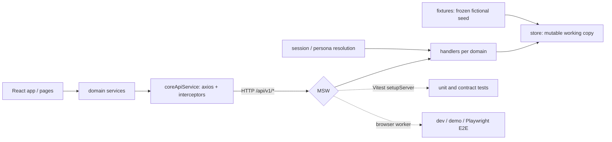

# Frontend mock architecture

> How Scrumooth runs without a backend, and why the mock lives at the HTTP boundary.

## What it is

Mock mode turns the frontend into a self-contained demo environment. There is no
server, no database and no second implementation of the product's rules inside the
app bundle: **Mock Service Worker** answers the application's own HTTP requests, so
every screen, guard and workflow runs exactly as it does against the real API.



The app is unaware of it. Pages and hooks call the domain services they always
called; the services build the same axios requests they always built; the
interceptors still add the CSRF header, still retry once through `/auth/refresh`
after a 401. Only the transport is answered locally.

## Why the boundary, not the service layer

An earlier implementation substituted the service objects themselves
(`VITE_USE_MOCK_API` chose between `mockApiService` and the real facades). It worked,
and it was the wrong shape:

- **The transport was never exercised.** Interceptors, CSRF handling, envelopes,
  status codes and the refresh flow were all bypassed in mock mode and only ever ran
  against a real server — so mock mode could be green while the app was broken.
- **The rules were described twice.** ~5,700 lines of hand-written service behaviour
  had to be kept in step with the real API by hand, and drifted.
- **Three mock layers disagreed.** An in-app fake, a jsdom fake and 47 Playwright
  `page.route` handlers each described the same endpoints differently.
- **It shipped.** Static imports plus a top-level `new MockApiService()` meant the
  fake layer landed in production bundles: a verified 40 KB gzip leak.

Mocking at the boundary fixes all four, and it collapses the three layers into one
registry shared by development, tests and E2E.

## Layers

| Layer               | Directory   | Rule                                                                                               |
| ------------------- | ----------- | -------------------------------------------------------------------------------------------------- |
| Frozen seed         | `fixtures/` | Pure fictional data. Never mutated, and never imports from `store/` or `handlers/`.                |
| Working copy        | `store/`    | A small typed database seeded from `fixtures/`, plus the acting session. Knows nothing about HTTP. |
| Endpoint responders | `handlers/` | Translate requests into store reads/writes. One module per domain group.                           |
| Shared plumbing     | `support/`  | Envelope builders, URL matching, latency, ids, gate refusals, scenario presets.                    |

Generation (`fixtures/`) is therefore separate from consumption (`store/`,
`handlers/`): changing demo content touches `fixtures/` only, and changing an
endpoint contract touches that domain's handler only.

`src/mocks/README.md` is the working guide — how to add a fixture, a collection and
a handler, and the ordering rules that keep a literal path from being read as an id.

## Bootstrap and the production boundary

`src/main.tsx` starts the worker before rendering, through a **conditional dynamic
import**:

```ts
if (import.meta.env.VITE_USE_MOCK_API === 'true') {
  const { startMockWorker } = await import('./mocks/browser');
  await startMockWorker();
}
```

Because the import is conditional and lazy, the entire mock layer — worker, handlers
and fixtures — is dropped from a normal production bundle. The same inline test
appears in the two other places that branch on mock mode (the login page's demo
panel and the sidebar's DEMO marker), so nothing in the application imports a module
from `src/mocks/`.

Three guarantees keep mock mode out of a real deployment:

1. **Explicit opt-in.** Only the exact string `'true'` enables it. The previous check
   (`!== 'false'`) failed open, so an unset variable pointed a real deployment at
   fabricated data.
2. **A build guard.** `vite.config.ts` fails the build when mocks are requested in a
   real production mode, so a mistyped flag is a build error rather than a demo
   served to users.
3. **A dedicated demo mode.** `--mode demo`, backed by the committed
   `packages/frontend/.env.demo`, is the only supported way to ship a build with
   mocks enabled. The GitHub Pages workflow uses it.

## Identity: the session, not a singleton

The real API authenticates with an httpOnly cookie. MSW cannot reproduce one — a
mocked `Set-Cookie` is applied to the document, so the `httpOnly` flag has no effect
— so the mock session lives in `localStorage` and stands in for that cookie. The
interface never reads it; it learns who it is from `GET /auth/me`.

Handlers resolve the acting user **from the request context**, and the role is
derived from the team membership:

- `GET /teams/my-teams` returns the person's teams with `userRole`, most-recently
  selected first, in the uppercase casing the workflow gates expect.
- `GET /teams/:teamId/my-role` answers per team, so the same person can be a Product
  Owner in one team and a Scrum Master in another.
- `POST /teams/select-team` records the switch.

That is what makes the login page's one-click persona cards possible at all — and
what makes switching team change the role, the menus and the available actions.

## Fidelity

The mock answers what the interface actually parses, including the shapes that are
not the standard envelope:

| Shape              | Endpoints                               | Why                  |
| ------------------ | --------------------------------------- | -------------------- |
| `{ count }`        | `GET /product-backlog/count`            | read as `data.count` |
| the inner document | `/user/export-data*`                    | read as `data.data`  |
| a real file body   | `GET /user/export-data/download/:jobId` | fetched as a blob    |

The notification endpoints are **not** in this table. `NotificationController` wraps
both `GET /notifications` and `GET /notifications/unread-count` in the standard
envelope, and so do the handlers; a table that listed them as inner payloads is what
led the unread-count handler to answer a bare `{ count }` while the client read
`data.count`, which is a bug that renders as an empty bell with no error.

Refusals carry the **gate contract**: the code and HTTP status come from
`GATE_DEFINITIONS` in `@scrumooth/shared`, the same table the backend throws from, so
the interface can present the rule, the Guide clause and the recovery action for it.
A gate a handler does not model is a gate the real API does not have either —
inventing one here would make the demo refuse something the product allows.

## Cost

- **Production:** zero. The layer is not in the bundle.
- **Development and demo:** one worker hop plus `VITE_MOCK_LATENCY_MS` of simulated
  latency (default 60 ms; `0` disables it).
- **Unit tests:** the registry is loaded per test file, which is the price of
  answering real HTTP in jsdom. Tests that mock a service directly do not pay it.
- **E2E:** the same registry the browser would have used in development, so no
  separate route layer has to be maintained.

## Extending it

1. Add the seed data to `fixtures/` as plain exported constants.
2. Add the collection to `store/db.ts` so handlers can read and write it.
3. Add `handlers/<domain>.handlers.ts` returning responses built with
   `support/envelope.ts`.
4. Register the module in `handlers/index.ts`, keeping static path segments before
   `:id` routes — MSW stops at the first handler that responds.
5. Add a contract test proving the success and the failure shape.

`pnpm dev` runs the app with the mock backend on; there is nothing to install and no
server to start.
